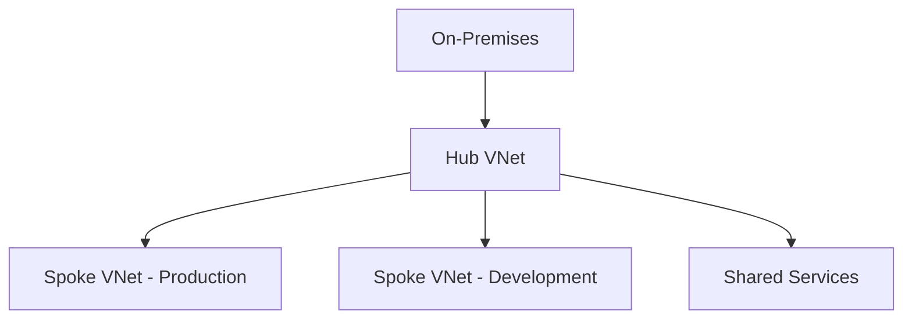

# 🏗️ Hub-and-Spoke Network Architecture

> Enterprise Azure networking model for centralized connectivity and governance.

---

# 📚 Table of Contents

- [🏗️ Hub-and-Spoke Network Architecture](#️-hub-and-spoke-network-architecture)
- [📚 Table of Contents](#-table-of-contents)
- [📌 Overview](#-overview)
- [🏗️ Architecture Diagram](#️-architecture-diagram)
- [🔑 Core Concepts](#-core-concepts)
- [⚙️ Hub-and-Spoke Components](#️-hub-and-spoke-components)
  - [Common Hub Services](#common-hub-services)
- [📊 Traffic Flow](#-traffic-flow)
- [🧪 Common Use Cases](#-common-use-cases)
- [🚨 Common Issues](#-common-issues)
  - [Spoke Connectivity Failure](#spoke-connectivity-failure)
    - [Possible Causes](#possible-causes)
  - [DNS Resolution Failure](#dns-resolution-failure)
    - [Common Causes](#common-causes)
- [✅ Best Practices](#-best-practices)
- [📖 References](#-references)

---

# 📌 Overview

Hub-and-Spoke is a centralized Azure networking topology used in enterprise environments.

Benefits include:

- Centralized security
- Shared services
- Simplified governance
- Scalable networking
- Hybrid connectivity integration

---

# 🏗️ Architecture Diagram

---

# 🔑 Core Concepts

| Component | Description |
|---|---|
| Hub VNet | Centralized services |
| Spoke VNet | Isolated workloads |
| VNet Peering | Connectivity |
| Shared Services | DNS, Firewall, VPN |

---

# ⚙️ Hub-and-Spoke Components

## Common Hub Services

- Azure Firewall
- VPN Gateway
- ExpressRoute Gateway
- DNS Services
- Bastion

---

# 📊 Traffic Flow

| Source | Destination |
|---|---|
| Spoke → Hub | Shared services |
| On-Prem → Spoke | Hybrid workloads |
| Internet → Hub | Central inspection |

---

# 🧪 Common Use Cases

- Enterprise networking
- Hybrid connectivity
- Multi-subscription environments
- Centralized security architecture

---

# 🚨 Common Issues

## Spoke Connectivity Failure

### Possible Causes

- Peering issue
- Route table conflict
- Firewall restriction

---

## DNS Resolution Failure

### Common Causes

- Missing DNS forwarders
- Incorrect VNet links
- Private DNS issue

---

# ✅ Best Practices

- Centralize security controls
- Use Azure Firewall
- Avoid overlapping IP ranges
- Use route tables carefully
- Document peering relationships

---

# 📖 References

- [Hub-and-Spoke Architecture Documentation](https://learn.microsoft.com/en-us/azure/architecture/networking/architecture/hub-spoke?utm_source=chatgpt.com)
- [Azure Networking Documentation](https://learn.microsoft.com/en-us/azure/networking/?utm_source=chatgpt.com)
- [Cloud Adoption Framework Networking Guidance](https://learn.microsoft.com/en-us/azure/cloud-adoption-framework/ready/azure-best-practices/plan-for-ip-addressing?utm_source=chatgpt.com)

---