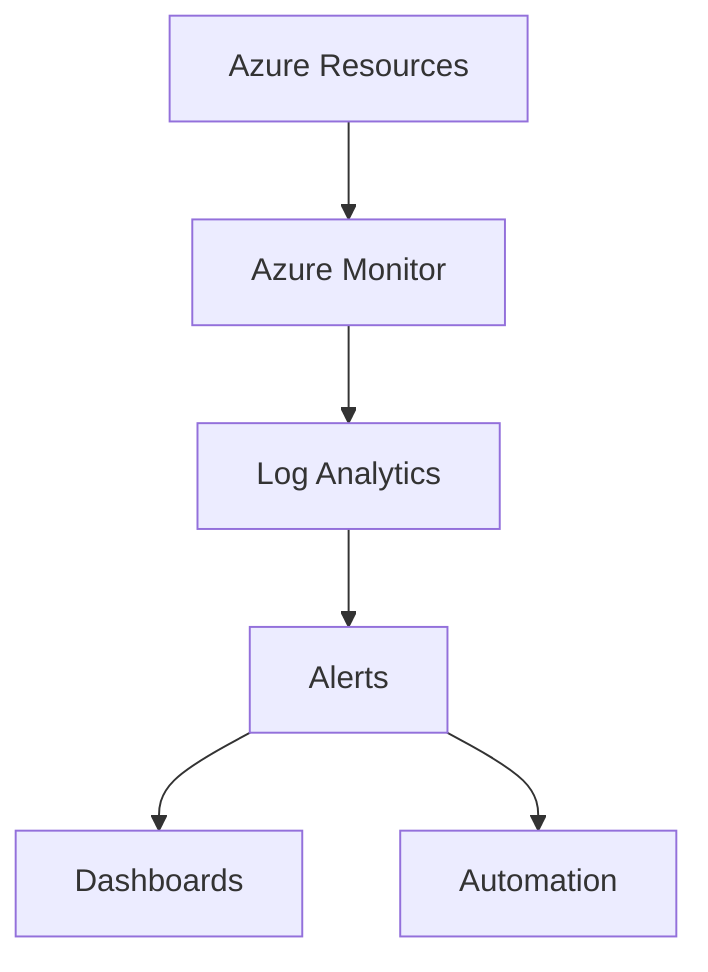

# 📊 Monitoring Architecture

> Enterprise monitoring and observability architecture for Azure environments.

---

# 📚 Table of Contents

- [� Monitoring Architecture](#-monitoring-architecture)
- [📚 Table of Contents](#-table-of-contents)
- [📌 Overview](#-overview)
- [🏗️ Architecture Diagram](#️-architecture-diagram)
- [🔑 Core Concepts](#-core-concepts)
- [⚙️ Monitoring Components](#️-monitoring-components)
  - [Core Azure Services](#core-azure-services)
- [📊 Observability Layers](#-observability-layers)
- [🧪 Monitoring Scenarios](#-monitoring-scenarios)
- [🚨 Common Issues](#-common-issues)
  - [Missing Monitoring Data](#missing-monitoring-data)
    - [Possible Causes](#possible-causes)
  - [Excessive Alerting](#excessive-alerting)
    - [Common Causes](#common-causes)
- [✅ Best Practices](#-best-practices)
- [📖 References](#-references)

---

# 📌 Overview

Monitoring architectures provide centralized visibility into Azure environments.

Enterprise monitoring focuses on:

- Metrics
- Logs
- Alerting
- Dashboards
- Incident response

---

# 🏗️ Architecture Diagram

---

# 🔑 Core Concepts

| Component | Description |
|---|---|
| Metrics | Performance telemetry |
| Logs | Operational data |
| Alerts | Incident notifications |
| Workbooks | Visualization dashboards |

---

# ⚙️ Monitoring Components

## Core Azure Services

- Azure Monitor
- Log Analytics
- Application Insights
- Action Groups
- Service Health

---

# 📊 Observability Layers

| Layer | Example |
|---|---|
| Infrastructure | VM metrics |
| Network | NSG flow logs |
| Application | App Insights |
| Security | Sign-in logs |

---

# 🧪 Monitoring Scenarios

- VM performance monitoring
- Security event monitoring
- Application troubleshooting
- Capacity planning
- Incident response

---

# 🚨 Common Issues

## Missing Monitoring Data

### Possible Causes

- Diagnostic settings disabled
- Incorrect workspace configuration
- Retention policy issue

---

## Excessive Alerting

### Common Causes

- Aggressive thresholds
- Duplicate alerts
- Poor alert tuning

---

# ✅ Best Practices

- Centralize monitoring
- Standardize alert rules
- Use dashboards for visibility
- Configure retention policies
- Test incident response workflows

---

# 📖 References

- [Azure Monitor Documentation](https://learn.microsoft.com/en-us/azure/azure-monitor/overview?utm_source=chatgpt.com)
- [Azure Well-Architected Framework Monitoring Guidance](https://learn.microsoft.com/en-us/azure/well-architected/operational-excellence/instrument-application?utm_source=chatgpt.com)
- [Azure Log Analytics Documentation](https://learn.microsoft.com/en-us/azure/azure-monitor/logs/log-analytics-overview?utm_source=chatgpt.com)

---