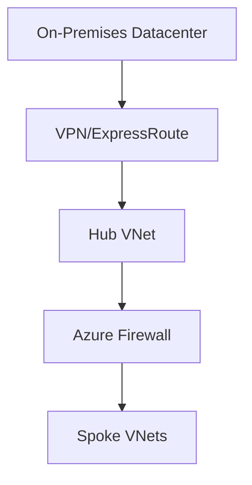

# 🔐 Secure Hybrid Network Architecture

> Enterprise hybrid connectivity architecture using Azure networking services.

---

# 📚 Table of Contents

- [� Secure Hybrid Network Architecture](#-secure-hybrid-network-architecture)
- [📚 Table of Contents](#-table-of-contents)
- [📌 Overview](#-overview)
- [🏗️ Architecture Diagram](#️-architecture-diagram)
- [🔑 Core Concepts](#-core-concepts)
- [⚙️ Hybrid Connectivity Components](#️-hybrid-connectivity-components)
  - [Core Services](#core-services)
- [📊 Connectivity Options](#-connectivity-options)
- [🧪 Common Scenarios](#-common-scenarios)
- [🚨 Common Issues](#-common-issues)
  - [Hybrid Connectivity Down](#hybrid-connectivity-down)
    - [Possible Causes](#possible-causes)
  - [DNS Resolution Problems](#dns-resolution-problems)
    - [Common Causes](#common-causes)
- [✅ Best Practices](#-best-practices)
- [📖 References](#-references)

---

# 📌 Overview

Hybrid network architectures connect on-premises environments with Azure securely.

Azure hybrid connectivity supports:

- Site-to-Site VPN
- ExpressRoute
- Hybrid DNS
- Identity federation

---

# 🏗️ Architecture Diagram

---

# 🔑 Core Concepts

| Component | Description |
|---|---|
| VPN Gateway | Encrypted connectivity |
| ExpressRoute | Private connectivity |
| Azure Firewall | Central inspection |
| Private DNS | Internal name resolution |

---

# ⚙️ Hybrid Connectivity Components

## Core Services

- VPN Gateway
- ExpressRoute
- Azure Firewall
- Bastion
- Private DNS Zones

---

# 📊 Connectivity Options

| Option | Use Case |
|---|---|
| Site-to-Site VPN | Small/medium environments |
| ExpressRoute | Enterprise workloads |
| Point-to-Site VPN | Remote users |

---

# 🧪 Common Scenarios

- Hybrid Active Directory
- Datacenter extension
- Disaster recovery
- Secure remote administration

---

# 🚨 Common Issues

## Hybrid Connectivity Down

### Possible Causes

- VPN tunnel failure
- BGP issue
- Firewall blocking traffic

---

## DNS Resolution Problems

### Common Causes

- Missing DNS forwarders
- Incorrect DNS servers
- Private zone issues

---

# ✅ Best Practices

- Use redundant gateways
- Centralize security inspection
- Use private connectivity when possible
- Monitor hybrid links continuously
- Document network topology

---

# 📖 References

- [Azure Hybrid Networking Documentation](https://learn.microsoft.com/en-us/azure/architecture/reference-architectures/hybrid-networking/?utm_source=chatgpt.com)
- [Azure VPN Gateway Documentation](https://learn.microsoft.com/en-us/azure/vpn-gateway/vpn-gateway-about-vpngateways?utm_source=chatgpt.com)
- [Azure ExpressRoute Documentation](https://learn.microsoft.com/en-us/azure/expressroute/expressroute-introduction?utm_source=chatgpt.com)

---