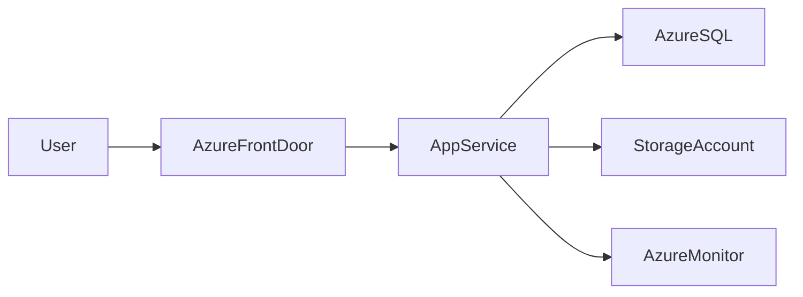

# 🌐 Azure App Services

> Fully managed platform for hosting web applications, APIs, and backend services in Azure.

---

## 📚 Table of Contents

- [🌐 Azure App Services](#-azure-app-services)
  - [📚 Table of Contents](#-table-of-contents)
- [📌 Overview](#-overview)
- [🏗️ Architecture](#️-architecture)
- [🔐 Core Concepts](#-core-concepts)
  - [Key Features](#key-features)
  - [Deployment Slots](#deployment-slots)
- [⚙️ Deployment](#️-deployment)
  - [Azure CLI](#azure-cli)
  - [Deploy from GitHub](#deploy-from-github)
- [🧪 Real-World Scenarios](#-real-world-scenarios)
- [🚨 Common Issues](#-common-issues)
  - [Application Startup Failure](#application-startup-failure)
    - [Possible Causes](#possible-causes)
    - [Impact](#impact)
  - [Performance Problems](#performance-problems)
    - [Possible Causes](#possible-causes-1)
- [✅ Best Practices](#-best-practices)
- [📊 Hosting Plans](#-hosting-plans)
- [📖 References](#-references)
- [🧠 Final Notes](#-final-notes)

---

# 📌 Overview

Azure App Services is a fully managed Platform as a Service (PaaS) offering for hosting:

- Web applications
- REST APIs
- Backend services
- Enterprise applications

Azure manages:

- Infrastructure
- Operating system updates
- Runtime environments
- Scaling
- Availability

> [!NOTE]
> Azure App Services supports multiple runtimes including .NET, Node.js, Python, Java, and PHP.

---

# 🏗️ Architecture



---

# 🔐 Core Concepts

## Key Features

| Feature | Description |
|---|---|
| Autoscaling | Dynamic resource scaling |
| Deployment Slots | Staging and production deployments |
| Built-in Security | HTTPS and authentication support |
| CI/CD Integration | GitHub and Azure DevOps integration |
| Managed Platform | Azure-managed infrastructure |

---

## Deployment Slots

Deployment slots allow testing application updates before production release.

Common slots:

- Production
- Staging
- Development

> [!IMPORTANT]
> Deployment slots help reduce downtime during application releases.

---

# ⚙️ Deployment

## Azure CLI

```bash
az webapp create \
  --resource-group RG-Production \
  --plan ASP-Production \
  --name app-production-01 \
  --runtime "PYTHON|3.11"
```

---

## Deploy from GitHub

```bash
az webapp deployment source config \
  --name app-production-01 \
  --resource-group RG-Production \
  --repo-url https://github.com/company/repository
```

---

# 🧪 Real-World Scenarios

| Scenario | Use Case |
|---|---|
| Enterprise web portal | Web App |
| REST API hosting | API App |
| Internal business application | App Service |
| CI/CD web deployment | Deployment Slots |
| Scalable frontend application | Autoscaling |

---

# 🚨 Common Issues

## Application Startup Failure

### Possible Causes

- Incorrect runtime version
- Missing environment variables
- Dependency failures
- Misconfigured startup commands

### Impact

- Application downtime
- Failed deployments
- Service interruptions

---

## Performance Problems

### Possible Causes

- Incorrect App Service Plan sizing
- Resource exhaustion
- Inefficient application code

> [!WARNING]
> Under-sized App Service Plans can cause latency and scaling issues in production environments.

---

# ✅ Best Practices

- Use deployment slots
- Enable autoscaling
- Integrate Application Insights
- Store secrets in Key Vault
- Restrict inbound access
- Use Managed Identities
- Enable HTTPS only

---

# 📊 Hosting Plans

| Plan | Characteristics |
|---|---|
| Free | Testing and learning |
| Basic | Small workloads |
| Standard | Production workloads |
| Premium | Advanced scaling and networking |

---

# 📖 References

- Microsoft Learn
- Azure App Services Documentation
- Azure Architecture Center

---

# 🧠 Final Notes

Azure App Services provides a scalable and operationally efficient platform for hosting enterprise applications without managing infrastructure directly.