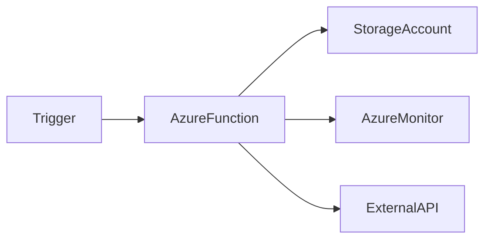

# ⚡ Azure Functions

> Serverless compute platform for event-driven and scalable cloud applications.

---

## 📚 Table of Contents

- [⚡ Azure Functions](#-azure-functions)
  - [📚 Table of Contents](#-table-of-contents)
- [📌 Overview](#-overview)
- [🏗️ Architecture](#️-architecture)
- [🔐 Core Concepts](#-core-concepts)
  - [Function Triggers](#function-triggers)
  - [Function Bindings](#function-bindings)
- [⚙️ Configuration](#️-configuration)
  - [Azure CLI](#azure-cli)
  - [Example HTTP Function](#example-http-function)
- [🧪 Real-World Scenarios](#-real-world-scenarios)
- [🚨 Common Issues](#-common-issues)
  - [Cold Start Delays](#cold-start-delays)
    - [Possible Causes](#possible-causes)
    - [Impact](#impact)
  - [Permission Failures](#permission-failures)
    - [Possible Causes](#possible-causes-1)
    - [Impact](#impact-1)
- [✅ Best Practices](#-best-practices)
- [📊 Hosting Plans](#-hosting-plans)
- [📖 References](#-references)
- [🧠 Final Notes](#-final-notes)

---

# 📌 Overview

Azure Functions is a serverless compute service that allows developers and cloud engineers to run code without managing infrastructure.

Azure automatically handles:

- Scaling
- Availability
- Runtime management
- Infrastructure maintenance

Common use cases include:

- API processing
- Automation
- Event-driven workflows
- Scheduled tasks
- Monitoring integrations

> [!NOTE]
> Azure Functions supports multiple programming languages including C#, Python, JavaScript, and PowerShell.

---

# 🏗️ Architecture



---

# 🔐 Core Concepts

## Function Triggers

| Trigger | Description |
|---|---|
| HTTP Trigger | Executes via web requests |
| Timer Trigger | Scheduled execution |
| Queue Trigger | Processes queue messages |
| Blob Trigger | Reacts to storage changes |
| Event Grid Trigger | Handles Azure events |

---

## Function Bindings

Bindings simplify connections between Azure services and the function runtime.

Examples:

- Blob Storage
- Cosmos DB
- Service Bus
- Queue Storage

---

# ⚙️ Configuration

## Azure CLI

```bash
az functionapp create \
  --resource-group RG-Production \
  --consumption-plan-location eastus \
  --runtime python \
  --functions-version 4 \
  --name func-production-01
```

---

## Example HTTP Function

```python
import azure.functions as func

def main(req: func.HttpRequest) -> func.HttpResponse:
    return func.HttpResponse("Azure Function running")
```

---

# 🧪 Real-World Scenarios

| Scenario | Use Case |
|---|---|
| Scheduled backups | Timer Trigger |
| File processing | Blob Trigger |
| Webhook integrations | HTTP Trigger |
| Monitoring automation | Event Grid Trigger |
| Queue processing | Queue Trigger |

---

# 🚨 Common Issues

## Cold Start Delays

### Possible Causes

- Consumption plan limitations
- Infrequent execution
- Runtime initialization

### Impact

- Increased response latency
- Slower API execution

> [!WARNING]
> Cold starts are common in serverless environments using consumption-based plans.

---

## Permission Failures

### Possible Causes

- Missing managed identity permissions
- Incorrect storage configuration
- RBAC misconfiguration

### Impact

- Trigger failures
- Application downtime
- Data processing interruptions

---

# ✅ Best Practices

- Use Managed Identities
- Enable Application Insights
- Monitor execution metrics
- Store secrets in Key Vault
- Use proper retry mechanisms
- Minimize cold start impact
- Apply least privilege RBAC

---

# 📊 Hosting Plans

| Plan | Characteristics |
|---|---|
| Consumption | Serverless pay-per-use |
| Premium | Reduced cold starts |
| Dedicated | App Service based hosting |

---

# 📖 References

- Microsoft Learn
- Azure Functions Documentation
- Azure Architecture Center

---

# 🧠 Final Notes

Azure Functions provides scalable and efficient serverless compute capabilities for modern cloud-native and event-driven architectures.