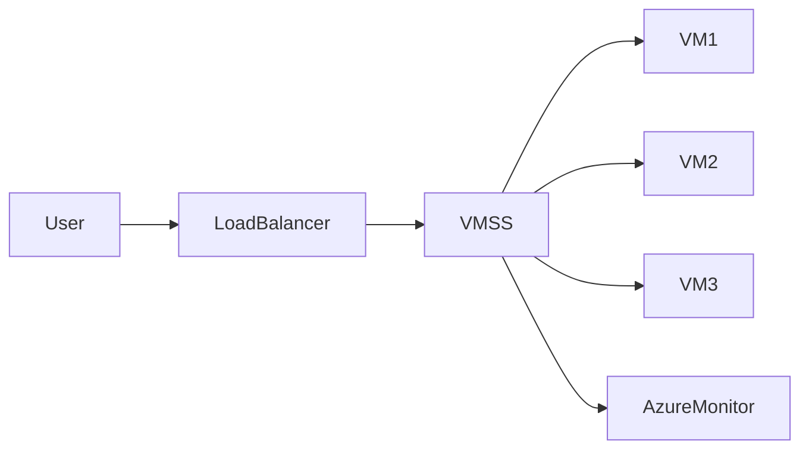

# ⚖️ Azure VM Scale Sets

> Scalable compute infrastructure designed for high availability and automatic scaling in Azure.

---

## 📚 Table of Contents

- [📌 Overview](#-overview)
- [🏗️ Architecture](#️-architecture)
- [🔐 Core Concepts](#-core-concepts)
- [⚙️ Configuration](#️-configuration)
- [🧪 Real-World Scenarios](#-real-world-scenarios)
- [🚨 Common Issues](#-common-issues)
- [✅ Best Practices](#-best-practices)
- [📊 Scaling Comparison](#-scaling-comparison)
- [📖 References](#-references)

---

# 📌 Overview

Azure VM Scale Sets (VMSS) allow organizations to deploy and manage groups of identical virtual machines with automatic scaling and load balancing capabilities.

VM Scale Sets are commonly used for:

- Web applications
- Microservices
- High-availability workloads
- Large-scale compute processing
- Containerized applications

> [!IMPORTANT]
> VM Scale Sets are designed for horizontal scaling, not vertical scaling.

---

# 🏗️ Architecture



---

# 🔐 Core Concepts

## Key Features

| Feature | Description |
|---|---|
| Autoscaling | Automatically adds or removes VMs |
| Load Balancing | Distributes incoming traffic |
| High Availability | Supports resilient deployments |
| Uniform Configuration | Consistent VM configuration |
| Managed Scaling | Azure-managed orchestration |

---

## Scaling Types

| Type | Description |
|---|---|
| Horizontal Scaling | Add/remove VM instances |
| Vertical Scaling | Increase VM size/resources |

> [!NOTE]
> VM Scale Sets primarily focus on horizontal scaling.

---

# ⚙️ Configuration

## Azure CLI

```bash
az vmss create \
  --resource-group RG-Production \
  --name VMSS-Web \
  --image Ubuntu2204 \
  --instance-count 2 \
  --upgrade-policy-mode automatic
```

---

## Enable Autoscaling

```bash
az monitor autoscale create \
  --resource-group RG-Production \
  --resource VMSS-Web
```

---

# 🧪 Real-World Scenarios

| Scenario | Benefit |
|---|---|
| E-commerce platform | Automatic scaling during peak traffic |
| API backend | Load-balanced infrastructure |
| Batch processing | Dynamic compute allocation |
| Enterprise web app | High availability |

---

# 🚨 Common Issues

## Uneven Traffic Distribution

### Possible Causes

- Misconfigured load balancer
- Health probe failures
- VM instance errors

### Impact

- Application instability
- Slow response times
- Increased latency

---

## Autoscaling Misconfiguration

### Examples

- Aggressive scaling thresholds
- Incorrect CPU metrics
- Insufficient scaling limits

> [!WARNING]
> Improper autoscaling configuration can increase operational costs significantly.

---

# ✅ Best Practices

- Use Availability Zones
- Configure health probes
- Enable autoscaling policies
- Monitor scaling metrics
- Use custom VM images when possible
- Implement centralized logging
- Restrict administrative access

---

# 📊 Scaling Comparison

| Feature | Virtual Machines | VM Scale Sets |
|---|---|---|
| Manual Scaling | Yes | Limited |
| Automatic Scaling | No | Yes |
| High Availability | Manual | Built-in |
| Load Balancing | Manual | Integrated |
| Enterprise Scalability | Medium | High |

---

# 📖 References

- Microsoft Learn
- Azure VM Scale Sets Documentation
- Azure Architecture Center

---

# 🧠 Final Notes

Azure VM Scale Sets provide scalable and resilient infrastructure for enterprise workloads requiring elasticity, availability, and automated resource management.