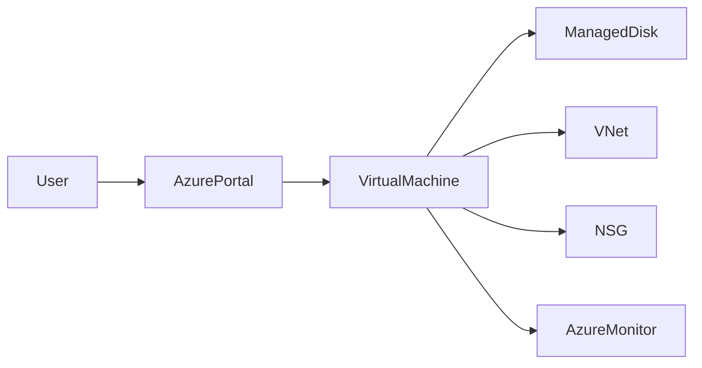

# 🖥️ Azure Virtual Machines

> Enterprise-grade Infrastructure as a Service (IaaS) compute resources in Microsoft Azure.

---

## 📚 Table of Contents

- [�️ Azure Virtual Machines](#️-azure-virtual-machines)
  - [📚 Table of Contents](#-table-of-contents)
- [📌 Overview](#-overview)
- [🏗️ Architecture](#️-architecture)
- [🔐 Core Concepts](#-core-concepts)
  - [VM Components](#vm-components)
  - [VM Types](#vm-types)
- [⚙️ Deployment](#️-deployment)
  - [Azure CLI](#azure-cli)
  - [PowerShell](#powershell)
- [🧪 Real-World Scenarios](#-real-world-scenarios)
- [🚨 Common Issues](#-common-issues)
  - [SSH/RDP Connectivity Failure](#sshrdp-connectivity-failure)
    - [Possible Causes](#possible-causes)
    - [Troubleshooting Steps](#troubleshooting-steps)
  - [High CPU Usage](#high-cpu-usage)
    - [Possible Causes](#possible-causes-1)
    - [Impact](#impact)
- [✅ Best Practices](#-best-practices)
- [📊 VM Size Comparison](#-vm-size-comparison)
- [📖 References](#-references)
- [🧠 Final Notes](#-final-notes)

---

# 📌 Overview

Azure Virtual Machines (VMs) provide scalable compute resources that allow organizations to deploy Windows and Linux workloads in the cloud.

Common use cases include:

- Web applications
- Domain controllers
- Database servers
- Dev/Test environments
- Enterprise applications
- Hybrid infrastructure

> [!NOTE]
> Azure Virtual Machines provide full operating system administrative access.

---

# 🏗️ Architecture



---

# 🔐 Core Concepts

## VM Components

| Component | Description |
|---|---|
| VM Size | Defines CPU and memory |
| OS Disk | Operating system storage |
| Data Disk | Additional application storage |
| VNet | Private network connectivity |
| NSG | Network traffic filtering |
| Availability Set | High availability configuration |

---

## VM Types

| Type | Use Case |
|---|---|
| General Purpose | Balanced workloads |
| Compute Optimized | High CPU applications |
| Memory Optimized | Database workloads |
| GPU | AI and rendering |

---

# ⚙️ Deployment

## Azure CLI

```bash
az vm create \
  --resource-group RG-Production \
  --name VM-Web-01 \
  --image Ubuntu2204 \
  --admin-username azureadmin
```

---

## PowerShell

```powershell
New-AzVM `
  -ResourceGroupName "RG-Production" `
  -Name "VM-Web-01"
```

> [!TIP]
> Use standardized naming conventions and tagging policies for enterprise environments.

---

# 🧪 Real-World Scenarios

| Scenario | Recommended Configuration |
|---|---|
| Web server hosting | General Purpose VM |
| SQL workloads | Memory Optimized VM |
| Development environment | Small B-Series VM |
| Domain controller | Availability Set deployment |

---

# 🚨 Common Issues

## SSH/RDP Connectivity Failure

### Possible Causes

- NSG blocking inbound traffic
- Incorrect public IP
- VM deallocated
- OS firewall restrictions

### Troubleshooting Steps

```bash
az vm list-ip-addresses \
  --resource-group RG-Production
```

---

## High CPU Usage

### Possible Causes

- Incorrect VM sizing
- Application inefficiencies
- Resource contention

### Impact

- Performance degradation
- Increased operational costs

> [!WARNING]
> Oversized VMs can significantly increase monthly Azure costs.

---

# ✅ Best Practices

- Use Managed Disks
- Enable Azure Backup
- Apply NSG restrictions
- Enable monitoring and diagnostics
- Use Availability Zones when possible
- Implement least privilege RBAC
- Enable automatic patching

---

# 📊 VM Size Comparison

| VM Size | vCPU | RAM | Use Case |
|---|---|---|---|
| B1s | 1 | 1 GB | Testing |
| B2s | 2 | 4 GB | Small workloads |
| D2s_v5 | 2 | 8 GB | Production applications |
| E4s_v5 | 4 | 32 GB | Database workloads |

---

# 📖 References

- Microsoft Learn
- Azure VM Documentation
- Azure Architecture Center

---

# 🧠 Final Notes

Azure Virtual Machines remain one of the most commonly used Azure services for enterprise infrastructure and hybrid cloud deployments.