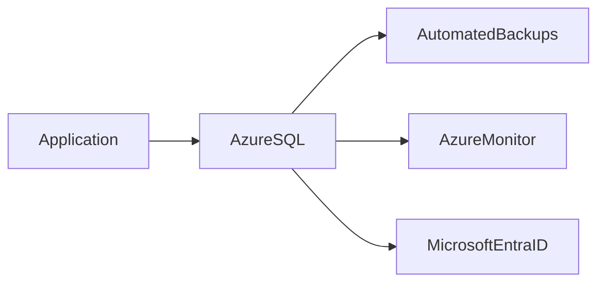

# 🗄️ Azure SQL Database

> Fully managed relational database platform for enterprise cloud applications.

---

## 📚 Table of Contents

- [📌 Overview](#-overview)
- [🏗️ Architecture](#️-architecture)
- [🔐 Core Concepts](#-core-concepts)
- [⚙️ Configuration](#️-configuration)
- [🧪 Real-World Scenarios](#-real-world-scenarios)
- [🚨 Common Issues](#-common-issues)
- [✅ Best Practices](#-best-practices)
- [📊 Service Tier Comparison](#-service-tier-comparison)
- [📖 References](#-references)

---

# 📌 Overview

Azure SQL Database is a fully managed relational database service based on Microsoft SQL Server.

Azure manages:

- Infrastructure
- Backups
- High availability
- Patching
- Monitoring

Common use cases include:

- Enterprise applications
- Web applications
- Reporting systems
- Business platforms

> [!NOTE]
> Azure SQL Database is a Platform as a Service (PaaS) offering.

---

# 🏗️ Architecture



---

# 🔐 Core Concepts

## Key Features

| Feature | Description |
|---|---|
| Automated Backups | Built-in backup management |
| High Availability | Microsoft-managed redundancy |
| Scaling | Dynamic compute and storage scaling |
| Security | Encryption and access control |
| Monitoring | Integrated diagnostics and metrics |

---

## Authentication Options

| Method | Description |
|---|---|
| SQL Authentication | Username and password |
| Microsoft Entra ID | Identity-based authentication |

> [!IMPORTANT]
> Microsoft Entra ID authentication is recommended for enterprise environments.

---

# ⚙️ Configuration

## Azure CLI

```bash
az sql server create \
  --name sql-prod-01 \
  --resource-group RG-Production \
  --location eastus \
  --admin-user sqladmin
```

---

## Create Database

```bash
az sql db create \
  --resource-group RG-Production \
  --server sql-prod-01 \
  --name appdb
```

---

# 🧪 Real-World Scenarios

| Scenario | Use Case |
|---|---|
| Enterprise ERP system | Relational database |
| Reporting platform | Structured queries |
| Web application backend | Transactional workloads |
| Financial systems | High availability database |

---

# 🚨 Common Issues

## Firewall Connectivity Problems

### Possible Causes

- Missing firewall rules
- Incorrect public IP
- Private endpoint misconfiguration

### Impact

- Application connection failures
- Authentication errors

---

## High DTU or CPU Usage

### Possible Causes

- Inefficient queries
- Missing indexes
- Under-sized service tier

> [!WARNING]
> Poor query optimization can significantly impact database performance and operational costs.

---

# ✅ Best Practices

- Use Microsoft Entra ID authentication
- Enable auditing and monitoring
- Use private endpoints when possible
- Apply least privilege access
- Monitor query performance
- Enable automatic backups
- Implement geo-redundancy for critical workloads

---

# 📊 Service Tier Comparison

| Tier | Use Case |
|---|---|
| Basic | Small development workloads |
| Standard | General business applications |
| Premium | High-performance enterprise workloads |

---

# 📖 References

- Microsoft Learn
- Azure SQL Documentation
- Azure Architecture Center

---

# 🧠 Final Notes

Azure SQL Database provides scalable, secure, and highly available relational database services for modern enterprise applications.