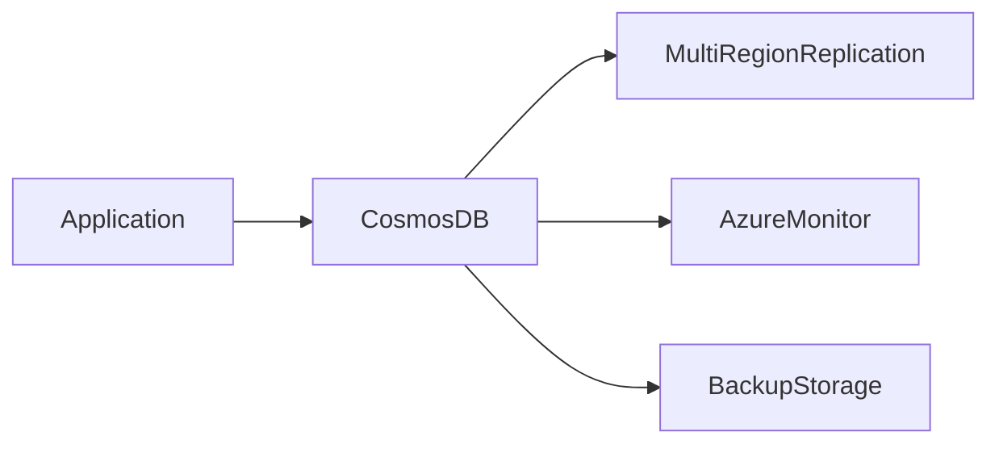

# 🌌 Azure Cosmos DB

> Globally distributed NoSQL database platform designed for high availability and low latency applications.

---

## 📚 Table of Contents

- [🌌 Azure Cosmos DB](#-azure-cosmos-db)
  - [📚 Table of Contents](#-table-of-contents)
- [📌 Overview](#-overview)
- [🏗️ Architecture](#️-architecture)
- [🔐 Core Concepts](#-core-concepts)
  - [Supported APIs](#supported-apis)
  - [Partitioning](#partitioning)
- [⚙️ Configuration](#️-configuration)
  - [Azure CLI](#azure-cli)
  - [Create SQL Database](#create-sql-database)
- [🧪 Real-World Scenarios](#-real-world-scenarios)
- [🚨 Common Issues](#-common-issues)
  - [High RU Consumption](#high-ru-consumption)
    - [Possible Causes](#possible-causes)
    - [Impact](#impact)
  - [Hot Partitions](#hot-partitions)
    - [Causes](#causes)
- [✅ Best Practices](#-best-practices)
- [📊 API Comparison](#-api-comparison)
- [📖 References](#-references)
- [🧠 Final Notes](#-final-notes)

---

# 📌 Overview

Azure Cosmos DB is a globally distributed NoSQL database service designed for scalable and low-latency applications.

Key capabilities include:

- Global replication
- Multi-region deployments
- Flexible APIs
- Automatic scaling
- High availability

Common use cases:

- IoT platforms
- Real-time analytics
- Global web applications
- Gaming platforms
- Microservices architectures

> [!NOTE]
> Cosmos DB supports both relational-style querying and NoSQL document storage models.

---

# 🏗️ Architecture



---

# 🔐 Core Concepts

## Supported APIs

| API | Description |
|---|---|
| SQL API | JSON document database |
| MongoDB API | MongoDB-compatible interface |
| Cassandra API | Cassandra-compatible workloads |
| Table API | Key-value workloads |
| Gremlin API | Graph database workloads |

---

## Partitioning

Cosmos DB uses partitioning to distribute data efficiently across infrastructure resources.

Benefits:

- Horizontal scaling
- High performance
- Improved availability

> [!IMPORTANT]
> Selecting an appropriate partition key is critical for performance optimization.

---

# ⚙️ Configuration

## Azure CLI

```bash
az cosmosdb create \
  --name cosmos-prod-01 \
  --resource-group RG-Production
```

---

## Create SQL Database

```bash
az cosmosdb sql database create \
  --account-name cosmos-prod-01 \
  --resource-group RG-Production \
  --name appdb
```

---

# 🧪 Real-World Scenarios

| Scenario | Use Case |
|---|---|
| Global ecommerce platform | Multi-region database |
| IoT telemetry | High-volume ingestion |
| Gaming leaderboards | Low latency workloads |
| Microservices backend | Flexible schema storage |

---

# 🚨 Common Issues

## High RU Consumption

### Possible Causes

- Inefficient queries
- Poor partition design
- Large cross-partition queries

### Impact

- Increased operational cost
- Query throttling
- Reduced performance

---

## Hot Partitions

### Causes

- Uneven partition key distribution
- Concentrated write activity

> [!WARNING]
> Poor partition key design is one of the most common Cosmos DB performance issues.

---

# ✅ Best Practices

- Design efficient partition keys
- Monitor RU consumption
- Enable automatic scaling
- Use regional replication
- Apply least privilege access
- Monitor latency and throughput
- Use Managed Identities when possible

---

# 📊 API Comparison

| API | Use Case |
|---|---|
| SQL API | General-purpose applications |
| MongoDB API | MongoDB compatibility |
| Cassandra API | Distributed workloads |
| Gremlin API | Graph relationships |

---

# 📖 References

- Microsoft Learn
- Azure Cosmos DB Documentation
- Azure Architecture Center

---

# 🧠 Final Notes

Azure Cosmos DB provides globally distributed, highly scalable NoSQL database capabilities for modern cloud-native and enterprise applications.