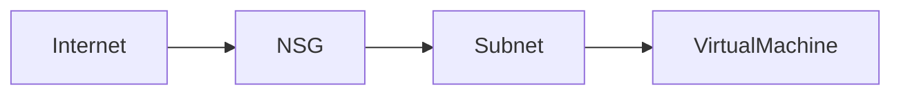

# 🔒 Network Security Groups (NSG)

> Traffic filtering and network access control for Azure resources.

---

## 📚 Table of Contents

- [� Network Security Groups (NSG)](#-network-security-groups-nsg)
  - [📚 Table of Contents](#-table-of-contents)
- [📌 Overview](#-overview)
- [🏗️ Architecture](#️-architecture)
- [🔐 Core Concepts](#-core-concepts)
  - [NSG Rules](#nsg-rules)
  - [Rule Actions](#rule-actions)
- [⚙️ Configuration](#️-configuration)
  - [Azure CLI](#azure-cli)
  - [Create Rule](#create-rule)
- [🧪 Real-World Scenarios](#-real-world-scenarios)
- [🚨 Common Issues](#-common-issues)
  - [Blocked Connectivity](#blocked-connectivity)
    - [Possible Causes](#possible-causes)
    - [Impact](#impact)
  - [Misconfigured Priorities](#misconfigured-priorities)
- [✅ Best Practices](#-best-practices)
- [📊 Rule Processing](#-rule-processing)
- [📖 References](#-references)
- [🧠 Final Notes](#-final-notes)

---

# 📌 Overview

Azure Network Security Groups (NSGs) control inbound and outbound network traffic for Azure resources.

NSGs can be associated with:

- Subnets
- Network Interfaces (NICs)

Common use cases:

- Restricting RDP/SSH access
- Application segmentation
- Network isolation
- Hybrid security enforcement

> [!IMPORTANT]
> NSGs are stateful firewall-like filtering mechanisms within Azure networking.

---

# 🏗️ Architecture



---

# 🔐 Core Concepts

## NSG Rules

Each rule contains:

- Source
- Destination
- Port
- Protocol
- Action
- Priority

---

## Rule Actions

| Action | Description |
|---|---|
| Allow | Permits traffic |
| Deny | Blocks traffic |

---

# ⚙️ Configuration

## Azure CLI

```bash
az network nsg create \
  --resource-group RG-Network \
  --name NSG-Web
```

---

## Create Rule

```bash
az network nsg rule create \
  --resource-group RG-Network \
  --nsg-name NSG-Web \
  --name Allow-HTTPS \
  --priority 100 \
  --destination-port-ranges 443 \
  --access Allow \
  --protocol Tcp
```

---

# 🧪 Real-World Scenarios

| Scenario | Use Case |
|---|---|
| Web server protection | Allow HTTPS only |
| Administrative access | Restrict RDP/SSH |
| Database isolation | Internal subnet filtering |
| Hybrid networking | Controlled traffic flows |

---

# 🚨 Common Issues

## Blocked Connectivity

### Possible Causes

- Incorrect NSG rule priority
- Missing allow rules
- Overly restrictive outbound filtering

### Impact

- Application communication failures
- VM access problems
- Service outages

---

## Misconfigured Priorities

> [!WARNING]
> Lower priority numbers are processed first in NSG rules.

Incorrect rule ordering can unintentionally block traffic.

---

# ✅ Best Practices

- Apply least privilege access
- Restrict management ports
- Use subnet-level NSGs
- Document rule changes
- Monitor flow logs
- Avoid overly permissive rules
- Use Application Security Groups when possible

---

# 📊 Rule Processing

| Priority | Action |
|---|---|
| Lower Number | Higher Priority |
| Higher Number | Lower Priority |

---

# 📖 References

- Microsoft Learn
- Azure NSG Documentation
- Azure Networking Documentation

---

# 🧠 Final Notes

NSGs are critical security controls used to secure Azure workloads and enforce enterprise network segmentation.