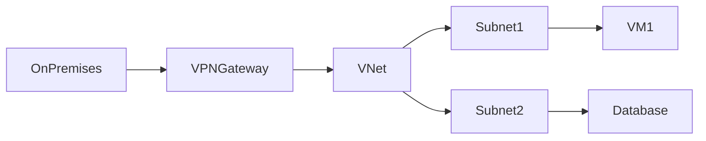

# 🌐 Azure Virtual Networks (VNets)

> Core networking service for secure communication between Azure resources and hybrid environments.

---

## 📚 Table of Contents

- [🌐 Azure Virtual Networks (VNets)](#-azure-virtual-networks-vnets)
  - [📚 Table of Contents](#-table-of-contents)
- [📌 Overview](#-overview)
- [🏗️ Architecture](#️-architecture)
- [🔐 Core Concepts](#-core-concepts)
  - [Key Components](#key-components)
  - [Address Spaces](#address-spaces)
- [⚙️ Configuration](#️-configuration)
  - [Azure CLI](#azure-cli)
  - [Create Subnet](#create-subnet)
- [🧪 Real-World Scenarios](#-real-world-scenarios)
- [🚨 Common Issues](#-common-issues)
  - [Connectivity Failures](#connectivity-failures)
    - [Possible Causes](#possible-causes)
    - [Impact](#impact)
  - [Overlapping Address Spaces](#overlapping-address-spaces)
- [✅ Best Practices](#-best-practices)
- [📊 Networking Components](#-networking-components)
- [📖 References](#-references)
- [🧠 Final Notes](#-final-notes)

---

# 📌 Overview

Azure Virtual Networks (VNets) provide isolated and secure networking environments for Azure resources.

VNets enable:

- Resource communication
- Hybrid connectivity
- Network segmentation
- Secure application deployment

> [!NOTE]
> VNets are foundational components for most Azure infrastructure deployments.

---

# 🏗️ Architecture



---

# 🔐 Core Concepts

## Key Components

| Component | Description |
|---|---|
| VNet | Logical Azure network |
| Subnet | Segmented network range |
| NSG | Traffic filtering |
| Route Table | Traffic routing |
| Peering | VNet-to-VNet connectivity |

---

## Address Spaces

VNets use private IP ranges such as:

```text
10.0.0.0/16
172.16.0.0/16
192.168.0.0/16
```

> [!IMPORTANT]
> Avoid overlapping IP ranges in hybrid and multi-VNet environments.

---

# ⚙️ Configuration

## Azure CLI

```bash
az network vnet create \
  --resource-group RG-Network \
  --name VNET-Production \
  --address-prefix 10.0.0.0/16
```

---

## Create Subnet

```bash
az network vnet subnet create \
  --resource-group RG-Network \
  --vnet-name VNET-Production \
  --name Subnet-Web \
  --address-prefixes 10.0.1.0/24
```

---

# 🧪 Real-World Scenarios

| Scenario | Use Case |
|---|---|
| Web application hosting | Segmented subnets |
| Hybrid infrastructure | VPN integration |
| Multi-tier architecture | Frontend/backend separation |
| Enterprise migration | Secure cloud networking |

---

# 🚨 Common Issues

## Connectivity Failures

### Possible Causes

- NSG restrictions
- Route table misconfiguration
- Incorrect subnet assignment
- DNS resolution problems

### Impact

- VM communication failures
- Application downtime
- Hybrid connectivity issues

---

## Overlapping Address Spaces

> [!WARNING]
> Overlapping IP ranges can prevent hybrid connectivity and VNet peering functionality.

---

# ✅ Best Practices

- Use subnet segmentation
- Apply NSG controls
- Document IP addressing
- Use private endpoints when possible
- Implement network monitoring
- Restrict public exposure
- Standardize naming conventions

---

# 📊 Networking Components

| Component | Purpose |
|---|---|
| VNet | Logical isolation |
| Subnet | Network segmentation |
| NSG | Security filtering |
| Peering | VNet communication |
| VPN Gateway | Hybrid connectivity |

---

# 📖 References

- [Microsoft Learn - Azure Virtual Network](https://learn.microsoft.com/en-us/azure/virtual-network/virtual-networks-overview)
- [Azure Virtual Network Documentation](https://learn.microsoft.com/en-us/azure/virtual-network/)
- [Introduction to Azure Virtual Networks](https://learn.microsoft.com/en-us/training/modules/introduction-to-azure-virtual-networks/)
- Azure Architecture Center

---

# 🧠 Final Notes

Azure VNets provide the networking foundation for scalable, secure, and enterprise-ready Azure environments.

