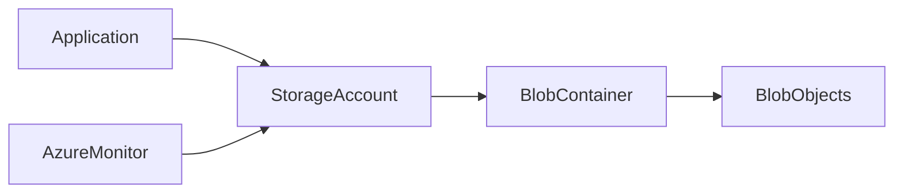

# 🪣 Azure Blob Storage

> Scalable object storage solution for unstructured data in Microsoft Azure.

---

## 📚 Table of Contents

- [🪣 Azure Blob Storage](#-azure-blob-storage)
  - [📚 Table of Contents](#-table-of-contents)
- [📌 Overview](#-overview)
- [🏗️ Architecture](#️-architecture)
- [🔐 Core Concepts](#-core-concepts)
  - [Blob Types](#blob-types)
  - [Storage Components](#storage-components)
- [⚙️ Configuration](#️-configuration)
  - [Azure CLI](#azure-cli)
  - [Create Container](#create-container)
- [🧪 Real-World Scenarios](#-real-world-scenarios)
- [🚨 Common Issues](#-common-issues)
  - [Access Denied Errors](#access-denied-errors)
    - [Possible Causes](#possible-causes)
    - [Impact](#impact)
  - [Excessive Storage Costs](#excessive-storage-costs)
- [✅ Best Practices](#-best-practices)
- [📊 Access Tiers](#-access-tiers)
- [📖 References](#-references)
- [🧠 Final Notes](#-final-notes)

---

# 📌 Overview

Azure Blob Storage is a massively scalable object storage service designed for storing unstructured data such as:

- Images
- Videos
- Backups
- Logs
- Documents
- Application data

Blob Storage is commonly used for:

- Cloud-native applications
- Backup solutions
- Disaster recovery
- Static website hosting
- Data lakes

> [!NOTE]
> Blob Storage is optimized for high durability and availability.

---

# 🏗️ Architecture



---

# 🔐 Core Concepts

## Blob Types

| Blob Type | Description |
|---|---|
| Block Blob | General object storage |
| Append Blob | Logging workloads |
| Page Blob | Virtual machine disks |

---

## Storage Components

| Component | Description |
|---|---|
| Storage Account | Azure storage namespace |
| Container | Logical grouping of blobs |
| Blob | Stored object/data |

---

# ⚙️ Configuration

## Azure CLI

```bash
az storage account create \
  --name stproduction01 \
  --resource-group RG-Storage \
  --sku Standard_LRS
```

---

## Create Container

```bash
az storage container create \
  --name backups \
  --account-name stproduction01
```

---

# 🧪 Real-World Scenarios

| Scenario | Use Case |
|---|---|
| Application backups | Blob containers |
| Static website hosting | Public blob access |
| Log storage | Append blobs |
| VM disk storage | Page blobs |

---

# 🚨 Common Issues

## Access Denied Errors

### Possible Causes

- Incorrect RBAC permissions
- Invalid SAS token
- Storage firewall restrictions

### Impact

- Application failures
- Backup interruptions
- Data access issues

---

## Excessive Storage Costs

> [!WARNING]
> Storing infrequently accessed data in hot tiers can significantly increase operational costs.

---

# ✅ Best Practices

- Use private endpoints
- Enable soft delete
- Apply lifecycle management policies
- Restrict public access
- Use RBAC over access keys when possible
- Monitor storage metrics
- Encrypt sensitive data

---

# 📊 Access Tiers

| Tier | Use Case |
|---|---|
| Hot | Frequently accessed data |
| Cool | Infrequently accessed data |
| Archive | Long-term archival storage |

---

# 📖 References

- [Microsoft Learn - Introduction to Azure Blob Storage](https://learn.microsoft.com/en-us/azure/storage/blobs/storage-blobs-introduction)
- [Azure Blob Storage Documentation](https://learn.microsoft.com/en-us/azure/storage/blobs/)
- [Microsoft Learn Training Module](https://learn.microsoft.com/en-us/training/modules/configure-blob-storage/)

---

# 🧠 Final Notes

Azure Blob Storage provides highly scalable and durable object storage capabilities for enterprise cloud environments.