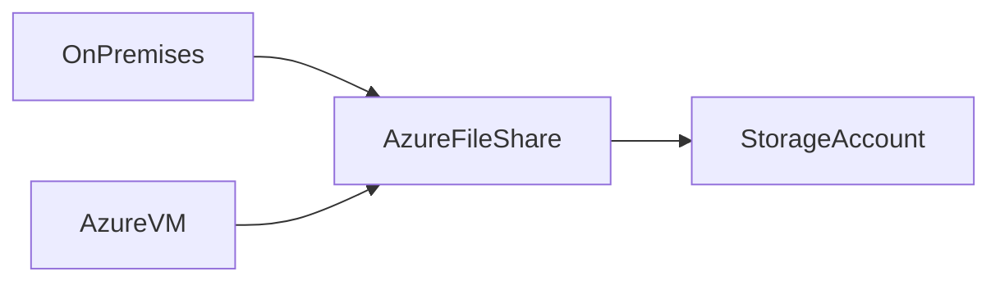

# 📂 Azure File Shares

> Managed cloud-based SMB file shares accessible from Azure and on-premises environments.

---

## 📚 Table of Contents

- [� Azure File Shares](#-azure-file-shares)
  - [📚 Table of Contents](#-table-of-contents)
- [📌 Overview](#-overview)
- [🏗️ Architecture](#️-architecture)
- [🔐 Core Concepts](#-core-concepts)
  - [Supported Protocols](#supported-protocols)
  - [Key Features](#key-features)
- [⚙️ Configuration](#️-configuration)
  - [Azure CLI](#azure-cli)
  - [Mount Example (Windows)](#mount-example-windows)
- [🧪 Real-World Scenarios](#-real-world-scenarios)
- [🚨 Common Issues](#-common-issues)
  - [Mount Failures](#mount-failures)
    - [Possible Causes](#possible-causes)
    - [Impact](#impact)
  - [Performance Bottlenecks](#performance-bottlenecks)
- [✅ Best Practices](#-best-practices)
- [📊 SMB vs NFS](#-smb-vs-nfs)
- [📖 References](#-references)
- [🧠 Final Notes](#-final-notes)

---

# 📌 Overview

Azure File Shares provides fully managed cloud file shares accessible through standard protocols such as:

- SMB
- NFS

Azure File Shares enables:

- Hybrid file storage
- Shared application storage
- Lift-and-shift migrations
- Centralized file management

> [!NOTE]
> Azure File Shares can be mounted simultaneously by multiple systems.

---

# 🏗️ Architecture



---

# 🔐 Core Concepts

## Supported Protocols

| Protocol | Use Case |
|---|---|
| SMB | Windows workloads |
| NFS | Linux workloads |

---

## Key Features

- Managed file shares
- Hybrid connectivity
- Snapshot support
- Identity integration
- Azure Backup integration

---

# ⚙️ Configuration

## Azure CLI

```bash
az storage share-rm create \
  --resource-group RG-Storage \
  --storage-account stproduction01 \
  --name sharedfiles
```

---

## Mount Example (Windows)

```powershell
net use Z: \\stproduction01.file.core.windows.net\sharedfiles
```

---

# 🧪 Real-World Scenarios

| Scenario | Use Case |
|---|---|
| Legacy application migration | SMB shares |
| Shared enterprise storage | Team collaboration |
| Hybrid infrastructure | Azure File Sync |
| Centralized configuration storage | Shared access |

---

# 🚨 Common Issues

## Mount Failures

### Possible Causes

- Port 445 blocked
- Incorrect credentials
- DNS resolution issues
- Firewall restrictions

### Impact

- Inaccessible file shares
- Application failures
- User access interruptions

---

## Performance Bottlenecks

> [!WARNING]
> Incorrect storage tier selection can negatively impact file share performance.

---

# ✅ Best Practices

- Use private endpoints
- Restrict network access
- Enable Azure Backup
- Monitor share utilization
- Use Azure File Sync for hybrid deployments
- Apply least privilege permissions

---

# 📊 SMB vs NFS

| Feature | SMB | NFS |
|---|---|---|
| Platform | Windows | Linux |
| Authentication | Active Directory | UNIX permissions |
| Common Use | Enterprise file shares | Linux workloads |

---

# 📖 References

- [Microsoft Learn - Azure Files Introduction](https://learn.microsoft.com/en-us/azure/storage/files/storage-files-introduction)
- [Azure Files Documentation](https://learn.microsoft.com/en-us/azure/storage/files/)
- [Microsoft Learn Training Module](https://learn.microsoft.com/en-us/training/modules/configure-azure-files-file-sync/)

---

# 🧠 Final Notes

Azure File Shares enables enterprise-grade shared storage for hybrid and cloud-native workloads using familiar file access protocols.