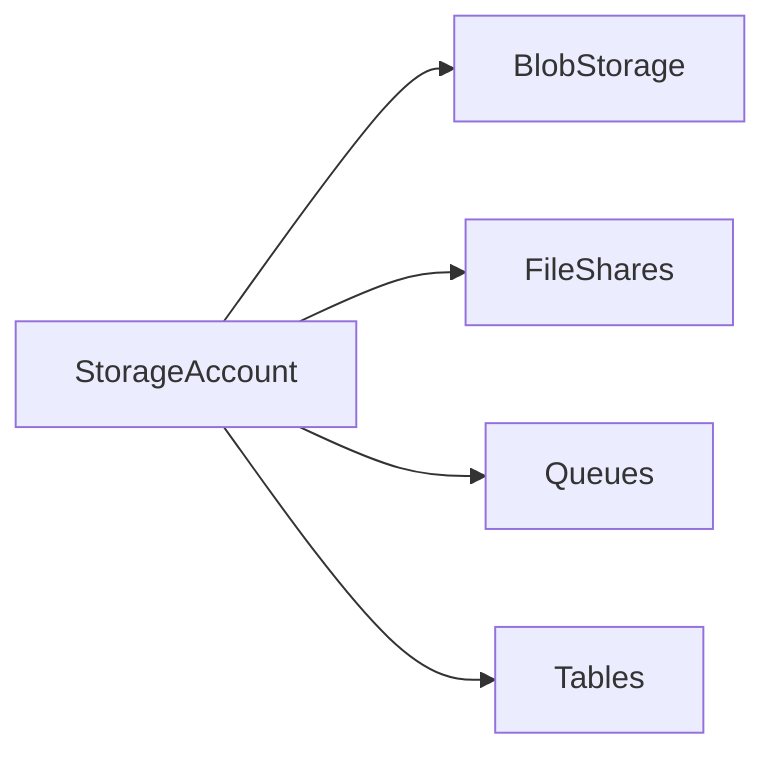

# 💾 Azure Storage Accounts

> Foundational storage resource used to host Azure storage services and data workloads.

---

## 📚 Table of Contents

- [� Azure Storage Accounts](#-azure-storage-accounts)
  - [📚 Table of Contents](#-table-of-contents)
- [📌 Overview](#-overview)
- [🏗️ Architecture](#️-architecture)
- [🔐 Core Concepts](#-core-concepts)
  - [Storage Account Types](#storage-account-types)
  - [Security Features](#security-features)
- [⚙️ Configuration](#️-configuration)
  - [Azure CLI](#azure-cli)
- [🧪 Real-World Scenarios](#-real-world-scenarios)
- [🚨 Common Issues](#-common-issues)
  - [Public Access Exposure](#public-access-exposure)
    - [Possible Causes](#possible-causes)
    - [Impact](#impact)
  - [Naming Conflicts](#naming-conflicts)
- [✅ Best Practices](#-best-practices)
- [📊 Storage Types](#-storage-types)
- [📖 References](#-references)
- [🧠 Final Notes](#-final-notes)

---

# 📌 Overview

Azure Storage Accounts provide a unique namespace for Azure storage services.

Supported services include:

- Blob Storage
- File Shares
- Queues
- Tables

Storage Accounts are foundational resources used throughout Azure infrastructure deployments.

> [!IMPORTANT]
> Storage Account design impacts security, performance, redundancy, and operational cost.

---

# 🏗️ Architecture



---

# 🔐 Core Concepts

## Storage Account Types

| Type | Use Case |
|---|---|
| General Purpose v2 | Most workloads |
| Premium | High-performance storage |
| Blob Storage | Object storage workloads |

---

## Security Features

- Encryption at rest
- Private endpoints
- Firewall rules
- RBAC integration
- SAS tokens

---

# ⚙️ Configuration

## Azure CLI

```bash
az storage account create \
  --name stproduction01 \
  --resource-group RG-Storage \
  --location eastus \
  --sku Standard_LRS
```

---

# 🧪 Real-World Scenarios

| Scenario | Use Case |
|---|---|
| VM diagnostics | Storage account logging |
| Application backups | Blob storage |
| Shared file storage | Azure Files |
| Queue-based processing | Queue storage |

---

# 🚨 Common Issues

## Public Access Exposure

### Possible Causes

- Misconfigured firewall rules
- Public blob access enabled
- Shared access keys exposed

### Impact

- Data exposure
- Security incidents
- Compliance violations

---

## Naming Conflicts

> [!WARNING]
> Storage Account names must be globally unique across Azure.

---

# ✅ Best Practices

- Disable public access when possible
- Use RBAC instead of account keys
- Enable soft delete
- Apply lifecycle management
- Use private endpoints
- Enable monitoring and diagnostics

---

# 📊 Storage Types

| Type | Performance |
|---|---|
| Standard HDD | General workloads |
| Standard SSD | Balanced performance |
| Premium SSD | High-performance workloads |

---

# 📖 References

- [Microsoft Learn - Azure Storage Accounts](https://learn.microsoft.com/en-us/azure/storage/common/storage-account-overview)
- [Azure Storage Documentation](https://learn.microsoft.com/en-us/azure/storage/)
- [Microsoft Learn Training Module](https://learn.microsoft.com/en-us/training/modules/configure-storage-accounts/)

---

# 🧠 Final Notes

Azure Storage Accounts provide the foundation for scalable, secure, and resilient Azure storage services.