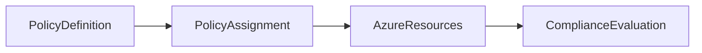

# 📏 Azure Policy

> Governance service used to enforce organizational standards and compliance across Azure resources.

---

## 📚 Table of Contents

- [� Azure Policy](#-azure-policy)
  - [📚 Table of Contents](#-table-of-contents)
- [📌 Overview](#-overview)
- [🏗️ Policy Architecture](#️-policy-architecture)
- [🔐 Core Concepts](#-core-concepts)
  - [Key Components](#key-components)
  - [Common Policy Use Cases](#common-policy-use-cases)
- [⚙️ Configuration](#️-configuration)
  - [Azure CLI](#azure-cli)
  - [List Policy Assignments](#list-policy-assignments)
- [🧪 Real-World Scenarios](#-real-world-scenarios)
- [🚨 Common Issues](#-common-issues)
  - [Unexpected Resource Denial](#unexpected-resource-denial)
    - [Possible Causes](#possible-causes)
    - [Impact](#impact)
  - [Compliance Drift](#compliance-drift)
- [✅ Best Practices](#-best-practices)
- [📊 Policy Effects](#-policy-effects)
- [📖 References](#-references)
- [🧠 Final Notes](#-final-notes)

---

# 📌 Overview

Azure Policy is a governance service used to evaluate and enforce organizational standards across Azure environments.

Azure Policy helps organizations:

- Enforce compliance
- Standardize deployments
- Restrict unsupported configurations
- Audit infrastructure
- Reduce operational risk

> [!IMPORTANT]
> Azure Policy evaluates resources continuously, not only during deployment.

---

# 🏗️ Policy Architecture



---

# 🔐 Core Concepts

## Key Components

| Component | Description |
|---|---|
| Policy Definition | Rule configuration |
| Initiative | Collection of policies |
| Assignment | Policy scope application |
| Compliance State | Evaluation result |

---

## Common Policy Use Cases

- Enforce tagging
- Restrict regions
- Require encryption
- Deny public IP deployment
- Enforce resource naming standards

---

# ⚙️ Configuration

## Azure CLI

```bash
az policy assignment create \
  --name EnforceTags \
  --policy policyDefinitionID \
  --scope /subscriptions/xxxxxxxx
```

---

## List Policy Assignments

```bash
az policy assignment list
```

---

# 🧪 Real-World Scenarios

| Scenario | Policy Example |
|---|---|
| Cost governance | Require tags |
| Security hardening | Deny public IPs |
| Compliance enforcement | Restrict locations |
| Storage protection | Require encryption |

---

# 🚨 Common Issues

## Unexpected Resource Denial

### Possible Causes

- Overly restrictive policies
- Incorrect scope assignment
- Missing policy exemptions

### Impact

- Deployment failures
- Operational delays
- Application rollout interruptions

---

## Compliance Drift

> [!WARNING]
> Resources deployed before policy assignment may become non-compliant over time.

---

# ✅ Best Practices

- Test policies in non-production environments
- Use initiatives for standardization
- Document governance requirements
- Apply policies incrementally
- Monitor compliance regularly
- Use exemptions carefully
- Avoid unnecessary restrictive policies

---

# 📊 Policy Effects

| Effect | Description |
|---|---|
| Deny | Blocks deployment |
| Audit | Logs non-compliance |
| Append | Adds configuration automatically |
| DeployIfNotExists | Deploys required resources |

---

# 📖 References

- [Microsoft Learn - Azure Policy Overview](https://learn.microsoft.com/en-us/azure/governance/policy/overview)
- [Azure Policy Documentation](https://learn.microsoft.com/en-us/azure/governance/policy/)
- [Microsoft Learn Training Module](https://learn.microsoft.com/en-us/training/modules/configure-manage-azure-policy/)

---

# 🧠 Final Notes

Azure Policy is a foundational governance service used to standardize and secure enterprise Azure environments at scale.