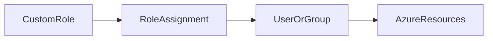

# 🧩 Azure Custom Roles

> Custom RBAC roles used to provide granular and organization-specific Azure permissions.

---

## 📚 Table of Contents

- [🧩 Azure Custom Roles](#-azure-custom-roles)
  - [📚 Table of Contents](#-table-of-contents)
- [📌 Overview](#-overview)
- [🏗️ Custom Role Architecture](#️-custom-role-architecture)
- [🔐 Core Concepts](#-core-concepts)
  - [Custom Role Components](#custom-role-components)
  - [Role Definition Structure](#role-definition-structure)
- [⚙️ Configuration](#️-configuration)
  - [Create Custom Role](#create-custom-role)
  - [List Custom Roles](#list-custom-roles)
- [🧪 Real-World Scenarios](#-real-world-scenarios)
- [🚨 Common Issues](#-common-issues)
  - [Overly Broad Permissions](#overly-broad-permissions)
    - [Possible Causes](#possible-causes)
    - [Impact](#impact)
  - [Invalid Role Definitions](#invalid-role-definitions)
    - [Symptoms](#symptoms)
- [✅ Best Practices](#-best-practices)
- [📊 Built-in vs Custom Roles](#-built-in-vs-custom-roles)
- [📖 References](#-references)
- [🧠 Final Notes](#-final-notes)

---

# 📌 Overview

Azure Custom Roles allow organizations to create granular permission models beyond Azure built-in roles.

Custom roles are commonly used when:

- Built-in roles are too permissive
- Organizations require compliance-specific access
- Teams need restricted operational permissions
- Security segmentation is required

> [!IMPORTANT]
> Custom roles should follow least privilege access principles.

---

# 🏗️ Custom Role Architecture



---

# 🔐 Core Concepts

## Custom Role Components

| Component | Description |
|---|---|
| Actions | Allowed operations |
| NotActions | Explicitly denied operations |
| AssignableScopes | Where the role can be assigned |
| Role Definition | JSON role configuration |

---

## Role Definition Structure

```json
{
  "Name": "VM Operator",
  "Actions": [
    "Microsoft.Compute/*/read"
  ],
  "AssignableScopes": [
    "/subscriptions/xxxxxxxx"
  ]
}
```

---

# ⚙️ Configuration

## Create Custom Role

```bash
az role definition create \
  --role-definition role.json
```

---

## List Custom Roles

```bash
az role definition list \
  --custom-role-only true
```

---

# 🧪 Real-World Scenarios

| Scenario | Custom Role Example |
|---|---|
| VM restart operations | VM Operator |
| Storage monitoring | Storage Reader |
| Backup administration | Backup Operator |
| Limited networking changes | Network Contributor Restricted |

---

# 🚨 Common Issues

## Overly Broad Permissions

### Possible Causes

- Wildcard permissions
- Poor role design
- Lack of permission reviews

### Impact

- Excessive privilege exposure
- Increased attack surface
- Governance failures

---

## Invalid Role Definitions

### Symptoms

- Role creation failure
- Assignment issues
- Authorization inconsistencies

> [!WARNING]
> Incorrect role definitions can unintentionally grant elevated access.

---

# ✅ Best Practices

- Use least privilege principles
- Document custom roles clearly
- Review role assignments regularly
- Avoid wildcard permissions when possible
- Use groups for assignments
- Test roles in non-production environments
- Implement approval processes

---

# 📊 Built-in vs Custom Roles

| Feature | Built-in Roles | Custom Roles |
|---|---|---|
| Microsoft Managed | Yes | No |
| Granularity | Limited | High |
| Maintenance | Automatic | Customer Managed |
| Flexibility | Medium | High |

---

# 📖 References

- [Microsoft Learn - Azure Custom Roles](https://learn.microsoft.com/en-us/azure/role-based-access-control/custom-roles)
- [Azure RBAC Documentation](https://learn.microsoft.com/en-us/azure/role-based-access-control/)
- [Microsoft Learn Training Module](https://learn.microsoft.com/en-us/training/modules/secure-azure-resources-with-rbac/)

---

# 🧠 Final Notes

Azure Custom Roles provide granular authorization capabilities required for mature enterprise governance and security models.