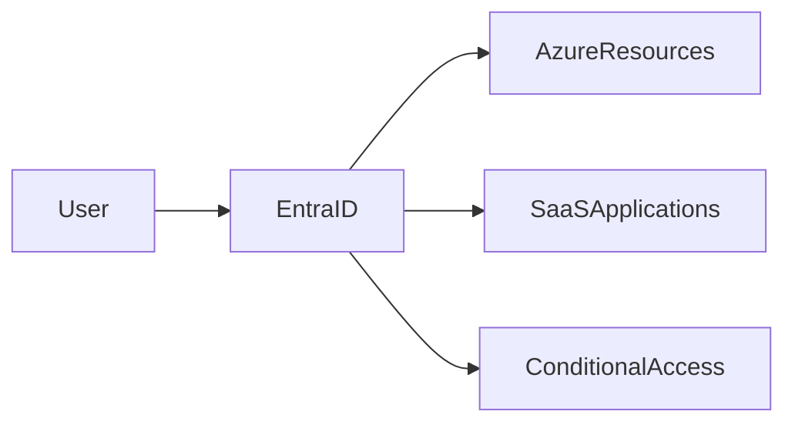

# 🆔 Microsoft Entra ID

> Cloud-based identity and access management platform for Azure and enterprise environments.

---

## 📚 Table of Contents

- [🆔 Microsoft Entra ID](#-microsoft-entra-id)
  - [📚 Table of Contents](#-table-of-contents)
- [📌 Overview](#-overview)
- [🏗️ Architecture](#️-architecture)
- [🔐 Core Concepts](#-core-concepts)
  - [Key Features](#key-features)
  - [Identity Types](#identity-types)
- [⚙️ Configuration](#️-configuration)
  - [Azure CLI](#azure-cli)
  - [Assign RBAC Role](#assign-rbac-role)
- [🧪 Real-World Scenarios](#-real-world-scenarios)
- [🚨 Common Issues](#-common-issues)
  - [Authentication Failures](#authentication-failures)
    - [Possible Causes](#possible-causes)
    - [Impact](#impact)
  - [Excessive Privileges](#excessive-privileges)
- [✅ Best Practices](#-best-practices)
- [📊 Identity Features](#-identity-features)
- [📖 References](#-references)
- [🧠 Final Notes](#-final-notes)

---

# 📌 Overview

Microsoft Entra ID is Microsoft's cloud-based identity and access management (IAM) platform.

It provides:

- Authentication
- Authorization
- Identity protection
- Conditional access
- Single Sign-On (SSO)

Common use cases include:

- Azure authentication
- Microsoft 365 access
- Hybrid identity integration
- Enterprise application authentication

> [!IMPORTANT]
> Microsoft Entra ID was previously known as Azure Active Directory (Azure AD).

---

# 🏗️ Architecture



---

# 🔐 Core Concepts

## Key Features

| Feature | Description |
|---|---|
| Authentication | User sign-in validation |
| Authorization | Resource access control |
| Conditional Access | Risk-based access policies |
| MFA | Additional identity verification |
| SSO | Single Sign-On experience |

---

## Identity Types

| Identity Type | Use Case |
|---|---|
| User Identity | Employee access |
| Service Principal | Application authentication |
| Managed Identity | Azure resource authentication |
| Guest User | External collaboration |

---

# ⚙️ Configuration

## Azure CLI

```bash
az ad user create \
  --display-name "Cloud Admin" \
  --user-principal-name admin@company.com
```

---

## Assign RBAC Role

```bash
az role assignment create \
  --assignee admin@company.com \
  --role Reader
```

---

# 🧪 Real-World Scenarios

| Scenario | Use Case |
|---|---|
| Employee authentication | User identities |
| Application access | Service principals |
| Secure Azure VM access | Managed identities |
| B2B collaboration | Guest accounts |

---

# 🚨 Common Issues

## Authentication Failures

### Possible Causes

- Incorrect credentials
- Conditional Access restrictions
- Expired passwords
- MFA enforcement issues

### Impact

- User access failures
- Application downtime
- Administrative lockouts

---

## Excessive Privileges

> [!WARNING]
> Overprivileged accounts significantly increase security risk and attack surface exposure.

---

# ✅ Best Practices

- Enable MFA for all users
- Apply Conditional Access
- Use least privilege RBAC
- Review permissions regularly
- Enable logging and auditing
- Use Managed Identities when possible
- Protect privileged accounts

---

# 📊 Identity Features

| Feature | Purpose |
|---|---|
| MFA | Identity protection |
| SSO | User convenience |
| Conditional Access | Risk-based access |
| Identity Protection | Threat detection |

---

# 📖 References

- [Microsoft Learn - Microsoft Entra ID](https://learn.microsoft.com/en-us/entra/fundamentals/whatis)
- [Microsoft Entra Documentation](https://learn.microsoft.com/en-us/entra/)
- [Microsoft Learn Training Module](https://learn.microsoft.com/en-us/training/modules/describe-azure-identity-access-security/)

---

# 🧠 Final Notes

Microsoft Entra ID is the core identity platform used to secure Azure environments and enterprise cloud applications.