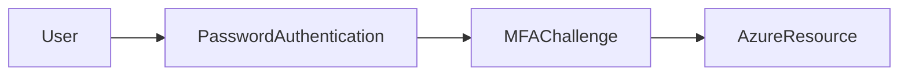

# 🔑 Multi-Factor Authentication (MFA)

> Additional authentication layer used to secure identities and reduce unauthorized access risks.

---

## 📚 Table of Contents

- [� Multi-Factor Authentication (MFA)](#-multi-factor-authentication-mfa)
  - [📚 Table of Contents](#-table-of-contents)
- [📌 Overview](#-overview)
- [🏗️ Authentication Flow](#️-authentication-flow)
- [🔐 Core Concepts](#-core-concepts)
  - [Authentication Factors](#authentication-factors)
  - [MFA Capabilities](#mfa-capabilities)
- [⚙️ MFA Methods](#️-mfa-methods)
- [🧪 Real-World Scenarios](#-real-world-scenarios)
- [🚨 Common Issues](#-common-issues)
  - [MFA Fatigue Attacks](#mfa-fatigue-attacks)
    - [Description](#description)
    - [Impact](#impact)
  - [Authentication Device Loss](#authentication-device-loss)
    - [Possible Causes](#possible-causes)
- [✅ Best Practices](#-best-practices)
- [📊 Authentication Methods](#-authentication-methods)
- [📖 References](#-references)
- [🧠 Final Notes](#-final-notes)

---

# 📌 Overview

Multi-Factor Authentication (MFA) strengthens security by requiring additional identity verification beyond passwords.

Authentication factors typically include:

- Something you know
- Something you have
- Something you are

MFA significantly reduces the risk of:

- Credential theft
- Password spraying
- Unauthorized access
- Identity compromise

> [!IMPORTANT]
> MFA is one of the most effective controls for protecting cloud identities.

---

# 🏗️ Authentication Flow

---

# 🔐 Core Concepts

## Authentication Factors

| Factor | Example |
|---|---|
| Knowledge | Password |
| Possession | Mobile device |
| Inherence | Fingerprint |

---

## MFA Capabilities

- Push notifications
- SMS verification
- Authenticator applications
- Hardware tokens
- Biometric verification

---

# ⚙️ MFA Methods

| Method | Security Level |
|---|---|
| SMS | Medium |
| Phone Call | Medium |
| Authenticator App | High |
| FIDO2 Security Key | Very High |

> [!NOTE]
> Microsoft recommends using Authenticator Apps or FIDO2 keys over SMS authentication.

---

# 🧪 Real-World Scenarios

| Scenario | MFA Benefit |
|---|---|
| Remote workforce | Secure remote access |
| Privileged administrators | Reduced credential compromise |
| SaaS applications | Identity protection |
| Hybrid environments | Centralized authentication security |

---

# 🚨 Common Issues

## MFA Fatigue Attacks

### Description

Attackers repeatedly trigger MFA prompts hoping users will approve requests accidentally.

### Impact

- Account compromise
- Unauthorized access
- Privilege escalation

---

## Authentication Device Loss

### Possible Causes

- Lost mobile device
- Hardware token failure
- Unregistered MFA methods

> [!WARNING]
> Organizations should implement secure MFA recovery procedures for administrative accounts.

---

# ✅ Best Practices

- Enforce MFA for all privileged users
- Use Conditional Access policies
- Prefer phishing-resistant MFA methods
- Avoid SMS when possible
- Monitor suspicious authentication activity
- Enable passwordless authentication where applicable
- Protect break-glass accounts

---

# 📊 Authentication Methods

| Method | Recommended |
|---|---|
| SMS | Limited |
| Authenticator App | Yes |
| FIDO2 Key | Strongly Recommended |
| Biometrics | Recommended |

---

# 📖 References

- [Microsoft Learn - MFA Overview](https://learn.microsoft.com/en-us/entra/identity/authentication/concept-mfa-howitworks)
- [Microsoft Entra MFA Documentation](https://learn.microsoft.com/en-us/entra/identity/authentication/)
- [Microsoft Learn Training Module](https://learn.microsoft.com/en-us/training/modules/secure-access-azure-active-directory-multi-factor-authentication/)

---

# 🧠 Final Notes

MFA is a critical security control used to protect enterprise identities and reduce the risk of cloud account compromise.