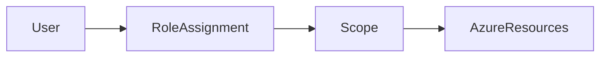

# 🛡️ Role-Based Access Control (RBAC)

> Authorization system used to control access to Azure resources using roles and permissions.

---

## 📚 Table of Contents

- [�️ Role-Based Access Control (RBAC)](#️-role-based-access-control-rbac)
  - [📚 Table of Contents](#-table-of-contents)
- [📌 Overview](#-overview)
- [🏗️ RBAC Architecture](#️-rbac-architecture)
- [🔐 Core Concepts](#-core-concepts)
  - [RBAC Components](#rbac-components)
  - [RBAC Scopes](#rbac-scopes)
- [⚙️ Configuration](#️-configuration)
  - [Azure CLI](#azure-cli)
  - [List Assignments](#list-assignments)
- [🧪 Real-World Scenarios](#-real-world-scenarios)
- [🚨 Common Issues](#-common-issues)
  - [Excessive Permissions](#excessive-permissions)
    - [Possible Causes](#possible-causes)
    - [Impact](#impact)
  - [Missing Permissions](#missing-permissions)
    - [Symptoms](#symptoms)
- [✅ Best Practices](#-best-practices)
- [📊 Built-in Roles](#-built-in-roles)
- [📖 References](#-references)
- [🧠 Final Notes](#-final-notes)

---

# 📌 Overview

Azure Role-Based Access Control (RBAC) is the authorization system used to manage access to Azure resources.

RBAC allows organizations to:

- Control resource permissions
- Enforce least privilege access
- Delegate administration securely
- Limit operational exposure

> [!IMPORTANT]
> RBAC controls WHAT actions identities can perform within Azure.

---

# 🏗️ RBAC Architecture



---

# 🔐 Core Concepts

## RBAC Components

| Component | Description |
|---|---|
| Security Principal | User, group, or application |
| Role Definition | Set of permissions |
| Scope | Resource level assignment |
| Role Assignment | Permission mapping |

---

## RBAC Scopes

| Scope | Description |
|---|---|
| Management Group | Highest organizational scope |
| Subscription | Azure subscription level |
| Resource Group | Resource collection |
| Resource | Individual Azure resource |

---

# ⚙️ Configuration

## Azure CLI

```bash
az role assignment create \
  --assignee admin@company.com \
  --role Reader \
  --scope /subscriptions/xxxxxxxx
```

---

## List Assignments

```bash
az role assignment list \
  --assignee admin@company.com
```

---

# 🧪 Real-World Scenarios

| Scenario | Recommended Role |
|---|---|
| VM monitoring | Reader |
| Infrastructure deployment | Contributor |
| Security auditing | Security Reader |
| Subscription administration | Owner |

---

# 🚨 Common Issues

## Excessive Permissions

### Possible Causes

- Overuse of Owner role
- Lack of RBAC reviews
- Poor governance processes

### Impact

- Unauthorized modifications
- Increased attack surface
- Compliance violations

---

## Missing Permissions

### Symptoms

- Deployment failures
- Access denied errors
- Monitoring visibility issues

> [!WARNING]
> Assigning broad permissions instead of troubleshooting root cause issues can create major security risks.

---

# ✅ Best Practices

- Apply least privilege access
- Avoid excessive Owner assignments
- Use groups instead of direct user assignments
- Review permissions regularly
- Document RBAC assignments
- Use Privileged Identity Management (PIM)
- Separate operational responsibilities

---

# 📊 Built-in Roles

| Role | Permissions |
|---|---|
| Owner | Full resource management |
| Contributor | Manage resources without access delegation |
| Reader | View-only access |
| User Access Administrator | Manage RBAC assignments |

---

# 📖 References

- [Microsoft Learn - Azure RBAC Overview](https://learn.microsoft.com/en-us/azure/role-based-access-control/overview)
- [Azure RBAC Documentation](https://learn.microsoft.com/en-us/azure/role-based-access-control/)
- [Microsoft Learn Training Module](https://learn.microsoft.com/en-us/training/modules/secure-azure-resources-with-rbac/)

---

# 🧠 Final Notes

RBAC is one of the most important security mechanisms in Azure and is essential for implementing secure enterprise access control models.