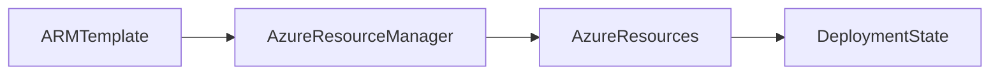

# 🏗️ ARM Templates

> Infrastructure as Code (IaC) solution used to deploy and manage Azure resources consistently and declaratively.

---

## 📚 Table of Contents

- [🏗️ ARM Templates](#️-arm-templates)
  - [📚 Table of Contents](#-table-of-contents)
- [📌 Overview](#-overview)
- [🏗️ ARM Architecture](#️-arm-architecture)
- [🔐 Core Concepts](#-core-concepts)
  - [Key Components](#key-components)
  - [Deployment Modes](#deployment-modes)
- [⚙️ Template Structure](#️-template-structure)
  - [Basic ARM Template](#basic-arm-template)
  - [Deploy ARM Template](#deploy-arm-template)
- [🧪 Deployment Examples](#-deployment-examples)
- [🚨 Common Issues](#-common-issues)
  - [Template Validation Failures](#template-validation-failures)
    - [Possible Causes](#possible-causes)
    - [Impact](#impact)
  - [Hardcoded Values](#hardcoded-values)
- [✅ Best Practices](#-best-practices)
- [📊 ARM vs Bicep](#-arm-vs-bicep)
- [📖 References](#-references)
- [🧠 Final Notes](#-final-notes)

---

# 📌 Overview

Azure Resource Manager (ARM) Templates are JSON-based Infrastructure as Code (IaC) files used to deploy and manage Azure resources declaratively.

ARM Templates help organizations:

- Standardize deployments
- Automate infrastructure provisioning
- Maintain consistency
- Reduce manual configuration errors
- Implement DevOps workflows

> [!IMPORTANT]
> ARM Templates are idempotent, meaning repeated deployments produce the same desired state.

---

# 🏗️ ARM Architecture



---

# 🔐 Core Concepts

## Key Components

| Component | Description |
|---|---|
| Parameters | User-defined input values |
| Variables | Reusable template values |
| Resources | Azure resources to deploy |
| Outputs | Deployment results |

---

## Deployment Modes

| Mode | Description |
|---|---|
| Incremental | Adds or updates resources |
| Complete | Removes resources not in template |

> [!WARNING]
> Complete deployment mode can delete existing resources not included in the template.

---

# ⚙️ Template Structure

## Basic ARM Template

```json
{
  "$schema": "https://schema.management.azure.com/schemas/2019-04-01/deploymentTemplate.json#",
  "contentVersion": "1.0.0.0",
  "resources": []
}
```

---

## Deploy ARM Template

```bash
az deployment group create \
  --resource-group RG-Production \
  --template-file template.json
```

---

# 🧪 Deployment Examples

| Scenario | ARM Use Case |
|---|---|
| VM deployment | Standardized infrastructure |
| Networking setup | Reusable network architecture |
| Enterprise environments | Automated provisioning |
| CI/CD pipelines | Infrastructure automation |

---

# 🚨 Common Issues

## Template Validation Failures

### Possible Causes

- Invalid JSON syntax
- Incorrect resource properties
- API version mismatch
- Missing dependencies

### Impact

- Failed deployments
- Inconsistent infrastructure
- Automation interruptions

---

## Hardcoded Values

> [!WARNING]
> Hardcoding credentials or environment-specific values creates security and operational risks.

---

# ✅ Best Practices

- Use parameter files
- Modularize templates
- Store templates in source control
- Validate templates before deployment
- Use naming conventions
- Avoid hardcoded secrets
- Implement CI/CD pipelines

---

# 📊 ARM vs Bicep

| Feature | ARM Templates | Bicep |
|---|---|---|
| Format | JSON | Declarative DSL |
| Readability | Complex | Simplified |
| Native Azure Support | Yes | Yes |
| Maintainability | Medium | High |

---

# 📖 References

- [Microsoft Learn - ARM Templates Overview](https://learn.microsoft.com/en-us/azure/azure-resource-manager/templates/overview)
- [Azure ARM Documentation](https://learn.microsoft.com/en-us/azure/azure-resource-manager/templates/)
- [Microsoft Learn Training Module](https://learn.microsoft.com/en-us/training/modules/create-azure-resource-manager-template-vs-code/)

---

# 🧠 Final Notes

ARM Templates provide repeatable and scalable infrastructure deployment capabilities required for enterprise cloud automation and governance.