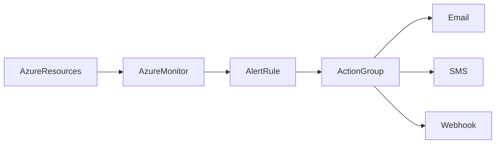

# 🚨 Azure Alerts

> Automated notification system used to detect and respond to operational and security events in Azure.

---

## 📚 Table of Contents

- [� Azure Alerts](#-azure-alerts)
  - [📚 Table of Contents](#-table-of-contents)
- [📌 Overview](#-overview)
- [🏗️ Alert Architecture](#️-alert-architecture)
- [🔐 Core Concepts](#-core-concepts)
  - [Alert Components](#alert-components)
  - [Notification Methods](#notification-methods)
- [⚙️ Configuration](#️-configuration)
  - [Azure CLI](#azure-cli)
  - [Create Action Group](#create-action-group)
- [🧪 Real-World Scenarios](#-real-world-scenarios)
- [🚨 Common Issues](#-common-issues)
  - [Alert Fatigue](#alert-fatigue)
    - [Possible Causes](#possible-causes)
    - [Impact](#impact)
  - [Missing Alerts](#missing-alerts)
- [✅ Best Practices](#-best-practices)
- [📊 Alert Types](#-alert-types)
- [📖 References](#-references)
- [🧠 Final Notes](#-final-notes)

---

# 📌 Overview

Azure Alerts provide automated notifications when defined conditions or thresholds are triggered.

Alerts help organizations:

- Detect incidents quickly
- Respond to operational issues
- Monitor infrastructure health
- Improve visibility
- Automate incident response

> [!IMPORTANT]
> Effective alerting is critical for operational reliability and incident response.

---

# 🏗️ Alert Architecture



---

# 🔐 Core Concepts

## Alert Components

| Component | Description |
|---|---|
| Alert Rule | Trigger condition |
| Action Group | Notification actions |
| Scope | Monitored resources |
| Condition | Threshold or event |

---

## Notification Methods

- Email
- SMS
- Push Notification
- Webhook
- ITSM Integration

---

# ⚙️ Configuration

## Azure CLI

```bash
az monitor metrics alert create \
  --name HighCPUAlert \
  --resource-group RG-Monitoring
```

---

## Create Action Group

```bash
az monitor action-group create \
  --name OperationsTeam
```

---

# 🧪 Real-World Scenarios

| Scenario | Alert Example |
|---|---|
| VM CPU spikes | Performance alert |
| Storage capacity threshold | Capacity alert |
| Failed logins | Security alert |
| Application downtime | Availability alert |

---

# 🚨 Common Issues

## Alert Fatigue

### Possible Causes

- Excessive thresholds
- Duplicate alerts
- Non-actionable alerts

### Impact

- Ignored notifications
- Delayed incident response
- Reduced operational effectiveness

---

## Missing Alerts

> [!WARNING]
> Incorrect diagnostic settings can prevent alerts from triggering properly.

---

# ✅ Best Practices

- Define actionable thresholds
- Avoid excessive notifications
- Use centralized action groups
- Test alerts regularly
- Monitor alert effectiveness
- Document escalation procedures
- Integrate alerts with incident management

---

# 📊 Alert Types

| Alert Type | Purpose |
|---|---|
| Metric Alerts | Performance monitoring |
| Log Alerts | KQL-based detection |
| Activity Log Alerts | Administrative monitoring |
| Smart Detection | AI-driven anomaly detection |

---

# 📖 References

- [Microsoft Learn - Azure Alerts Overview](https://learn.microsoft.com/en-us/azure/azure-monitor/alerts/alerts-overview)
- [Azure Monitor Alerts Documentation](https://learn.microsoft.com/en-us/azure/azure-monitor/alerts/)
- [Microsoft Learn Training Module](https://learn.microsoft.com/en-us/training/modules/respond-to-alerts-azure-monitor/)

---

# 🧠 Final Notes

Azure Alerts provide critical operational visibility and automated incident detection capabilities required for enterprise cloud operations.