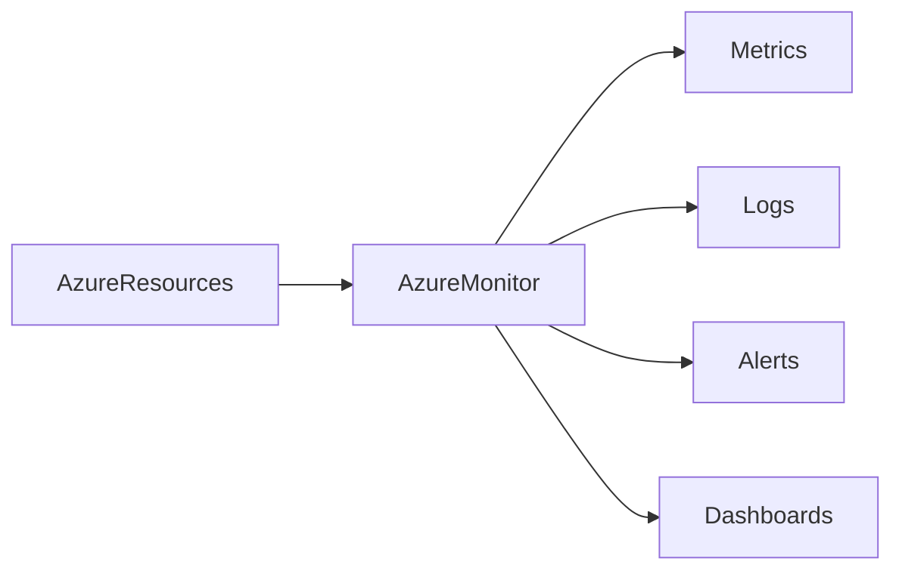

# 📈 Azure Monitor

> Centralized monitoring platform for collecting, analyzing, and responding to telemetry across Azure environments.

---

## 📚 Table of Contents

- [� Azure Monitor](#-azure-monitor)
  - [📚 Table of Contents](#-table-of-contents)
- [📌 Overview](#-overview)
- [🏗️ Monitoring Architecture](#️-monitoring-architecture)
- [🔐 Core Concepts](#-core-concepts)
  - [Monitoring Data Types](#monitoring-data-types)
  - [Monitored Resources](#monitored-resources)
- [⚙️ Configuration](#️-configuration)
  - [Azure CLI](#azure-cli)
  - [View Metrics](#view-metrics)
- [🧪 Real-World Scenarios](#-real-world-scenarios)
- [🚨 Common Issues](#-common-issues)
  - [Missing Diagnostic Data](#missing-diagnostic-data)
    - [Possible Causes](#possible-causes)
    - [Impact](#impact)
  - [Excessive Alert Noise](#excessive-alert-noise)
- [✅ Best Practices](#-best-practices)
- [📊 Monitoring Components](#-monitoring-components)
- [📖 References](#-references)
- [🧠 Final Notes](#-final-notes)

---

# 📌 Overview

Azure Monitor is Microsoft's centralized monitoring solution used to collect, analyze, and respond to telemetry from Azure resources and applications.

Azure Monitor supports:

- Metrics collection
- Log analysis
- Alerting
- Visualization
- Performance monitoring

> [!IMPORTANT]
> Azure Monitor is one of the core operational services used in enterprise Azure environments.

---

# 🏗️ Monitoring Architecture



---

# 🔐 Core Concepts

## Monitoring Data Types

| Type | Description |
|---|---|
| Metrics | Numerical performance data |
| Logs | Detailed operational records |
| Alerts | Automated notifications |
| Insights | Resource-specific monitoring views |

---

## Monitored Resources

- Virtual Machines
- Storage Accounts
- VNets
- Azure SQL
- App Services
- Containers

---

# ⚙️ Configuration

## Azure CLI

```bash
az monitor diagnostic-settings create \
  --name VM-Diagnostics \
  --resource /subscriptions/xxxx/resourceGroups/RG-Production/providers/Microsoft.Compute/virtualMachines/VM-Web-01
```

---

## View Metrics

```bash
az monitor metrics list \
  --resource VM-Web-01
```

---

# 🧪 Real-World Scenarios

| Scenario | Monitoring Use |
|---|---|
| VM CPU spikes | Performance monitoring |
| Application downtime | Alert generation |
| Security auditing | Log collection |
| Capacity planning | Metrics analysis |

---

# 🚨 Common Issues

## Missing Diagnostic Data

### Possible Causes

- Diagnostics not enabled
- Incorrect Log Analytics workspace
- Permission issues

### Impact

- Reduced troubleshooting visibility
- Incomplete monitoring data
- Incident investigation delays

---

## Excessive Alert Noise

> [!WARNING]
> Poorly configured alerts can generate alert fatigue and reduce operational effectiveness.

---

# ✅ Best Practices

- Enable diagnostics for critical resources
- Centralize monitoring workspaces
- Use actionable alerts only
- Monitor costs and retention
- Apply tagging standards
- Use dashboards for visibility
- Document monitoring baselines

---

# 📊 Monitoring Components

| Component | Purpose |
|---|---|
| Metrics | Performance monitoring |
| Logs | Operational analysis |
| Alerts | Incident notification |
| Insights | Resource visualization |

---

# 📖 References

- [Microsoft Learn - Azure Monitor Overview](https://learn.microsoft.com/en-us/azure/azure-monitor/overview)
- [Azure Monitor Documentation](https://learn.microsoft.com/en-us/azure/azure-monitor/)
- [Microsoft Learn Training Module](https://learn.microsoft.com/en-us/training/modules/monitor-azure-resources-with-azure-monitor/)

---

# 🧠 Final Notes

Azure Monitor provides centralized observability capabilities required for enterprise-scale cloud operations and troubleshooting.