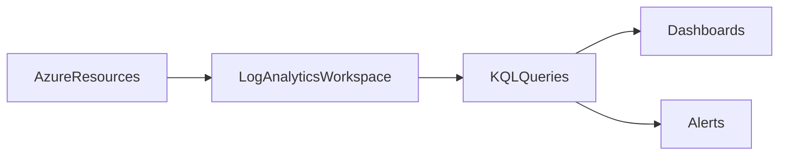

# 📜 Azure Log Analytics

> Centralized log collection and query platform used for operational monitoring, troubleshooting, and security analysis.

---

## 📚 Table of Contents

- [� Azure Log Analytics](#-azure-log-analytics)
  - [📚 Table of Contents](#-table-of-contents)
- [📌 Overview](#-overview)
- [🏗️ Architecture](#️-architecture)
- [🔐 Core Concepts](#-core-concepts)
  - [Key Components](#key-components)
  - [Common Log Sources](#common-log-sources)
- [⚙️ Configuration](#️-configuration)
  - [Create Workspace](#create-workspace)
  - [Query Logs](#query-logs)
- [🧪 Query Examples](#-query-examples)
  - [Failed Sign-ins](#failed-sign-ins)
  - [High CPU Usage](#high-cpu-usage)
  - [VM Availability](#vm-availability)
- [🚨 Common Issues](#-common-issues)
  - [Missing Logs](#missing-logs)
    - [Possible Causes](#possible-causes)
    - [Impact](#impact)
  - [Expensive Queries](#expensive-queries)
- [✅ Best Practices](#-best-practices)
- [📊 Log Sources](#-log-sources)
- [📖 References](#-references)
- [🧠 Final Notes](#-final-notes)

---

# 📌 Overview

Azure Log Analytics is the centralized logging platform used with Azure Monitor for collecting, storing, and querying telemetry data.

It enables organizations to:

- Analyze logs
- Investigate incidents
- Monitor infrastructure
- Detect anomalies
- Troubleshoot operational issues

> [!IMPORTANT]
> Log Analytics uses Kusto Query Language (KQL) for querying and analysis.

---

# 🏗️ Architecture



---

# 🔐 Core Concepts

## Key Components

| Component | Description |
|---|---|
| Workspace | Centralized log repository |
| Data Sources | Azure resources sending logs |
| KQL | Query language for analysis |
| Retention Policies | Log storage duration |

---

## Common Log Sources

- Virtual Machines
- Azure Activity Logs
- NSG Flow Logs
- Azure SQL
- App Services
- Security Events

---

# ⚙️ Configuration

## Create Workspace

```bash
az monitor log-analytics workspace create \
  --resource-group RG-Monitoring \
  --workspace-name LAW-Production
```

---

## Query Logs

```kusto
Heartbeat
| summarize count() by Computer
```

---

# 🧪 Query Examples

## Failed Sign-ins

```kusto
SigninLogs
| where ResultType != 0
```

---

## High CPU Usage

```kusto
Perf
| where CounterName == "% Processor Time"
```

---

## VM Availability

```kusto
Heartbeat
| summarize LastSeen=max(TimeGenerated) by Computer
```

---

# 🚨 Common Issues

## Missing Logs

### Possible Causes

- Diagnostics disabled
- Incorrect workspace configuration
- RBAC permission issues
- Retention policy expiration

### Impact

- Reduced troubleshooting visibility
- Incomplete security investigations
- Operational blind spots

---

## Expensive Queries

> [!WARNING]
> Inefficient KQL queries can increase query execution time and monitoring costs.

---

# ✅ Best Practices

- Centralize logs into shared workspaces
- Use meaningful naming conventions
- Monitor ingestion costs
- Apply retention policies carefully
- Restrict workspace access
- Use saved queries for operational consistency
- Enable security logging

---

# 📊 Log Sources

| Source | Purpose |
|---|---|
| Activity Logs | Administrative actions |
| VM Logs | Infrastructure monitoring |
| NSG Logs | Network analysis |
| Security Logs | Threat investigation |

---

# 📖 References

- [Microsoft Learn - Log Analytics Overview](https://learn.microsoft.com/en-us/azure/azure-monitor/logs/log-analytics-overview)
- [Azure Monitor Logs Documentation](https://learn.microsoft.com/en-us/azure/azure-monitor/logs/)
- [Microsoft Learn - KQL Queries](https://learn.microsoft.com/en-us/azure/data-explorer/kusto/query/)

---

# 🧠 Final Notes

Azure Log Analytics provides centralized observability and operational intelligence capabilities for enterprise Azure environments.