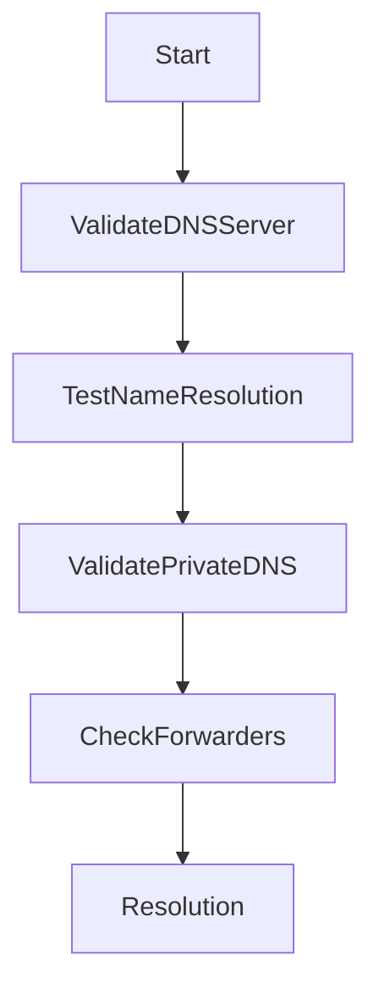

# 🚨 Azure DNS Issues

> Troubleshooting DNS resolution and name resolution failures in Azure environments.

---

## 📚 Table of Contents

- [� Azure DNS Issues](#-azure-dns-issues)
  - [📚 Table of Contents](#-table-of-contents)
- [📌 Overview](#-overview)
- [🌐 Common Symptoms](#-common-symptoms)
- [🔍 Possible Root Causes](#-possible-root-causes)
- [🧪 Troubleshooting Workflow](#-troubleshooting-workflow)
- [⚙️ Diagnostic Commands](#️-diagnostic-commands)
  - [Test DNS Resolution](#test-dns-resolution)
  - [Check VNet DNS Settings](#check-vnet-dns-settings)
  - [Validate Private DNS Zones](#validate-private-dns-zones)
- [🚨 Real-World Scenario](#-real-world-scenario)
  - [Incident](#incident)
    - [Root Cause](#root-cause)
    - [Resolution](#resolution)
- [✅ Prevention Best Practices](#-prevention-best-practices)
- [📖 References](#-references)
- [🧠 Final Notes](#-final-notes)

---

# 📌 Overview

DNS issues in Azure environments commonly affect connectivity, authentication, hybrid networking, and private endpoint communication.

Affected services include:

- Virtual Machines
- Private Endpoints
- VPN connectivity
- Hybrid identity services

---

# 🌐 Common Symptoms

| Symptom | Description |
|---|---|
| Hostname resolution failure | DNS lookup unsuccessful |
| Private endpoint inaccessible | Internal name resolution issue |
| Authentication failure | Identity service unreachable |
| Intermittent connectivity | DNS forwarding instability |

---

# 🔍 Possible Root Causes

| Cause | Impact |
|---|---|
| Incorrect DNS server configuration | Resolution failure |
| Broken DNS forwarding | Hybrid communication issues |
| Missing private DNS zones | Private endpoint failures |
| Firewall restrictions | DNS query blocking |

---

# 🧪 Troubleshooting Workflow



---

# ⚙️ Diagnostic Commands

## Test DNS Resolution

```bash
nslookup storageaccount.blob.core.windows.net
```

---

## Check VNet DNS Settings

```bash
az network vnet show \
  --resource-group RG-Network \
  --name VNET-Production
```

---

## Validate Private DNS Zones

```bash
az network private-dns zone list
```

---

# 🚨 Real-World Scenario

## Incident

Application unable to access Azure SQL private endpoint.

### Root Cause

Private DNS zone not linked to production VNet.

### Resolution

- Linked DNS zone
- Validated DNS forwarding
- Tested endpoint resolution

---

# ✅ Prevention Best Practices

- Standardize DNS architecture
- Document DNS forwarding rules
- Use private DNS zones
- Monitor DNS availability
- Validate hybrid DNS integration
- Restrict unauthorized DNS changes

---

# 📖 References

- [Microsoft Learn - Azure DNS Troubleshooting](https://learn.microsoft.com/en-us/azure/dns/dns-troubleshoot)
- [Azure DNS Documentation](https://learn.microsoft.com/en-us/azure/dns/)
- [Azure Private DNS Documentation](https://learn.microsoft.com/en-us/azure/dns/private-dns-overview)

---

# 🧠 Final Notes

DNS stability is critical for maintaining connectivity, authentication, and operational reliability across Azure environments.