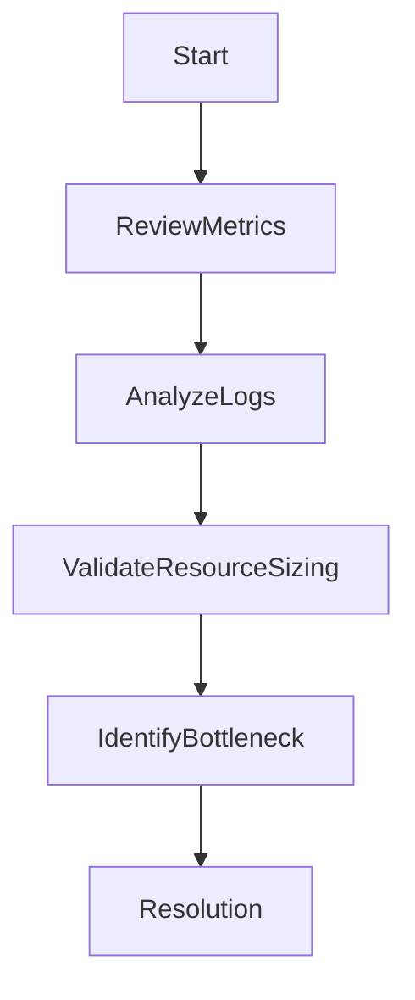

# 🚨 Azure Performance Issues

> Troubleshooting performance bottlenecks affecting Azure infrastructure and applications.

---

## 📚 Table of Contents

- [� Azure Performance Issues](#-azure-performance-issues)
  - [📚 Table of Contents](#-table-of-contents)
- [📌 Overview](#-overview)
- [📊 Common Symptoms](#-common-symptoms)
- [🔍 Possible Root Causes](#-possible-root-causes)
- [🧪 Troubleshooting Workflow](#-troubleshooting-workflow)
- [⚙️ Monitoring Commands](#️-monitoring-commands)
  - [VM Metrics](#vm-metrics)
  - [Log Analytics Query](#log-analytics-query)
  - [App Service Metrics](#app-service-metrics)
- [🚨 Real-World Scenario](#-real-world-scenario)
  - [Incident](#incident)
    - [Root Cause](#root-cause)
    - [Resolution](#resolution)
- [✅ Prevention Best Practices](#-prevention-best-practices)
- [📖 References](#-references)
- [🧠 Final Notes](#-final-notes)

---

# 📌 Overview

Azure performance issues can affect application responsiveness, infrastructure stability, and operational reliability.

Commonly affected components include:

- Virtual Machines
- Networking
- Storage
- Databases
- App Services

---

# 📊 Common Symptoms

| Symptom | Description |
|---|---|
| High CPU usage | Resource saturation |
| Slow application response | Performance degradation |
| Storage latency | Delayed disk operations |
| Network bottlenecks | Packet delay |

---

# 🔍 Possible Root Causes

| Cause | Impact |
|---|---|
| Incorrect VM sizing | Resource exhaustion |
| Inefficient queries | Database slowdown |
| Storage throttling | High latency |
| Network congestion | Connectivity degradation |

---

# 🧪 Troubleshooting Workflow



---

# ⚙️ Monitoring Commands

## VM Metrics

```bash
az monitor metrics list \
  --resource VM-Web-01
```

---

## Log Analytics Query

```kusto
Perf
| where CounterName == "% Processor Time"
```

---

## App Service Metrics

```bash
az monitor metrics list \
  --resource app-production-01
```

---

# 🚨 Real-World Scenario

## Incident

Production web application experiencing high response latency.

### Root Cause

Under-sized App Service Plan combined with storage latency spikes.

### Resolution

- Scaled App Service Plan
- Optimized storage configuration
- Added performance alerts

---

# ✅ Prevention Best Practices

- Monitor performance baselines
- Enable diagnostics and logging
- Use autoscaling when appropriate
- Review resource utilization regularly
- Optimize storage tiers
- Validate database performance
- Implement proactive alerting

---

# 📖 References

- [Microsoft Learn - Azure Performance Troubleshooting](https://learn.microsoft.com/en-us/troubleshoot/azure/)
- [Azure Monitor Documentation](https://learn.microsoft.com/en-us/azure/azure-monitor/)
- [Azure Well-Architected Framework](https://learn.microsoft.com/en-us/azure/well-architected/)

---

# 🧠 Final Notes

Effective monitoring and systematic troubleshooting are essential for maintaining high-performance Azure environments.