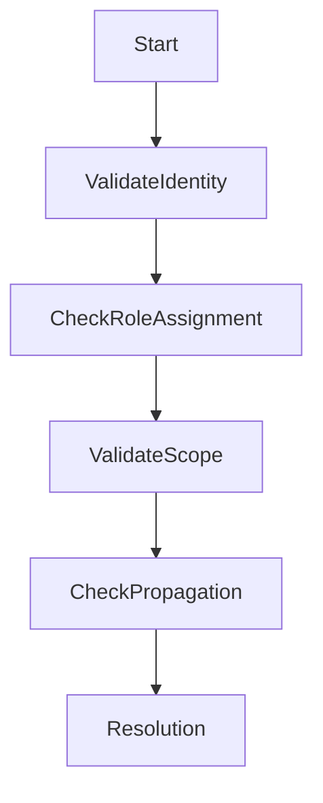

# 🚨 Azure RBAC Permission Issues

> Troubleshooting authorization failures and access control problems in Azure environments.

---

## 📚 Table of Contents

- [� Azure RBAC Permission Issues](#-azure-rbac-permission-issues)
  - [📚 Table of Contents](#-table-of-contents)
- [📌 Overview](#-overview)
- [🔐 Common Symptoms](#-common-symptoms)
- [🔍 Possible Root Causes](#-possible-root-causes)
- [🧪 Troubleshooting Workflow](#-troubleshooting-workflow)
- [⚙️ Diagnostic Commands](#️-diagnostic-commands)
  - [List Role Assignments](#list-role-assignments)
  - [Validate Subscription Context](#validate-subscription-context)
  - [Check Resource Scope](#check-resource-scope)
- [🚨 Real-World Scenario](#-real-world-scenario)
  - [Incident](#incident)
    - [Root Cause](#root-cause)
    - [Resolution](#resolution)
- [✅ Prevention Best Practices](#-prevention-best-practices)
- [📖 References](#-references)
- [🧠 Final Notes](#-final-notes)

---

# 📌 Overview

RBAC permission problems are among the most common operational issues in Azure environments.

These issues often affect:

- Resource deployments
- VM administration
- Storage access
- Monitoring visibility
- Automation workflows

---

# 🔐 Common Symptoms

| Symptom | Description |
|---|---|
| AuthorizationFailed | Insufficient permissions |
| Access denied | Resource access blocked |
| Deployment failure | Missing RBAC assignment |
| Portal visibility issues | Reader permissions missing |

---

# 🔍 Possible Root Causes

| Cause | Impact |
|---|---|
| Missing role assignment | Access failure |
| Incorrect scope | Limited visibility |
| Propagation delay | Temporary authorization issues |
| Deny assignments | Explicit access restriction |

---

# 🧪 Troubleshooting Workflow



---

# ⚙️ Diagnostic Commands

## List Role Assignments

```bash
az role assignment list \
  --assignee admin@company.com
```

---

## Validate Subscription Context

```bash
az account show
```

---

## Check Resource Scope

```bash
az resource show \
  --name VM-Web-01
```

---

# 🚨 Real-World Scenario

## Incident

Automation account unable to restart production VMs.

### Root Cause

Contributor role assigned at incorrect resource group scope.

### Resolution

- Corrected RBAC scope
- Revalidated automation identity permissions
- Tested operational workflow

---

# ✅ Prevention Best Practices

- Use least privilege access
- Assign permissions to groups
- Review RBAC regularly
- Document scope assignments
- Use PIM for privileged access
- Avoid unnecessary Owner assignments

---

# 📖 References

- [Microsoft Learn - Azure RBAC Troubleshooting](https://learn.microsoft.com/en-us/azure/role-based-access-control/troubleshooting)
- [Azure RBAC Documentation](https://learn.microsoft.com/en-us/azure/role-based-access-control/)
- [Microsoft Entra Documentation](https://learn.microsoft.com/en-us/entra/)

---

# 🧠 Final Notes

Proper RBAC design and troubleshooting processes are essential for secure and operationally stable Azure environments.