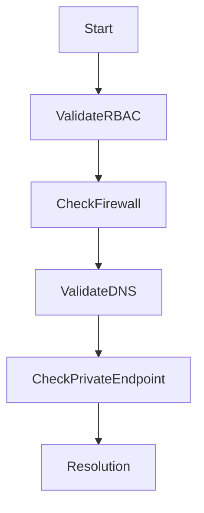

# 🚨 Azure Storage Access Issues

> Troubleshooting authentication, connectivity, and authorization problems affecting Azure Storage services.

---

## 📚 Table of Contents

- [� Azure Storage Access Issues](#-azure-storage-access-issues)
  - [📚 Table of Contents](#-table-of-contents)
- [📌 Overview](#-overview)
- [💾 Common Symptoms](#-common-symptoms)
- [🔍 Possible Root Causes](#-possible-root-causes)
- [🧪 Troubleshooting Workflow](#-troubleshooting-workflow)
- [⚙️ Diagnostic Commands](#️-diagnostic-commands)
  - [List Storage Accounts](#list-storage-accounts)
  - [Validate Network Rules](#validate-network-rules)
  - [Check RBAC Assignments](#check-rbac-assignments)
- [🚨 Real-World Scenario](#-real-world-scenario)
  - [Incident](#incident)
    - [Root Cause](#root-cause)
    - [Resolution](#resolution)
- [✅ Prevention Best Practices](#-prevention-best-practices)
- [📖 References](#-references)
- [🧠 Final Notes](#-final-notes)

---

# 📌 Overview

Azure Storage access problems commonly involve authentication failures, firewall restrictions, RBAC misconfiguration, or network isolation issues.

Affected services include:

- Blob Storage
- Azure Files
- Queues
- Tables

---

# 💾 Common Symptoms

| Symptom | Description |
|---|---|
| Access denied | Authorization failure |
| Mount failure | File share inaccessible |
| SAS token invalid | Authentication rejected |
| Timeout errors | Network communication failure |

---

# 🔍 Possible Root Causes

| Cause | Impact |
|---|---|
| Incorrect RBAC permissions | Access denied |
| Firewall restrictions | Connectivity blocked |
| Expired SAS tokens | Authentication failure |
| Private endpoint DNS issues | Resource unreachable |

---

# 🧪 Troubleshooting Workflow



---

# ⚙️ Diagnostic Commands

## List Storage Accounts

```bash
az storage account list
```

---

## Validate Network Rules

```bash
az storage account network-rule list \
  --resource-group RG-Storage \
  --account-name stproduction01
```

---

## Check RBAC Assignments

```bash
az role assignment list \
  --scope /subscriptions/xxxx
```

---

# 🚨 Real-World Scenario

## Incident

Application unable to upload files to Blob Storage.

### Root Cause

Storage firewall configured to deny public traffic without private endpoint DNS resolution.

### Resolution

- Fixed DNS forwarding
- Updated VNet integration
- Validated private endpoint configuration

---

# ✅ Prevention Best Practices

- Use RBAC instead of access keys
- Restrict public network access
- Enable private endpoints
- Monitor storage diagnostics
- Rotate SAS tokens regularly
- Apply least privilege access

---

# 📖 References

- [Microsoft Learn - Azure Storage Troubleshooting](https://learn.microsoft.com/en-us/troubleshoot/azure/azure-storage/)
- [Azure Storage Documentation](https://learn.microsoft.com/en-us/azure/storage/)
- [Azure Private Endpoint Documentation](https://learn.microsoft.com/en-us/azure/private-link/private-endpoint-overview)

---

# 🧠 Final Notes

Most Azure Storage access issues are related to networking, RBAC configuration, or identity authentication problems.