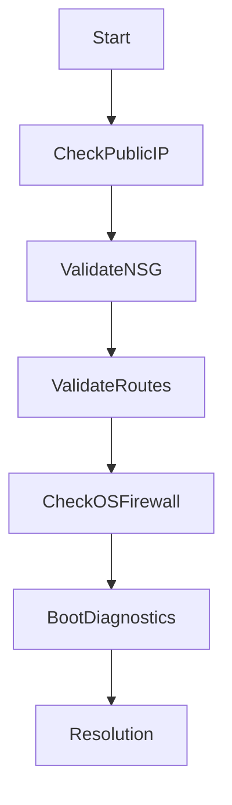

# 🚨 Azure VM Connection Issues

> Troubleshooting connectivity failures affecting Azure Virtual Machines.

---

## 📚 Table of Contents

- [� Azure VM Connection Issues](#-azure-vm-connection-issues)
  - [📚 Table of Contents](#-table-of-contents)
- [📌 Overview](#-overview)
- [🖥️ Common Symptoms](#️-common-symptoms)
- [🔍 Possible Root Causes](#-possible-root-causes)
- [🧪 Troubleshooting Workflow](#-troubleshooting-workflow)
- [⚙️ Azure CLI Diagnostics](#️-azure-cli-diagnostics)
  - [Check Public IP](#check-public-ip)
  - [Validate NSG Rules](#validate-nsg-rules)
  - [Check Effective Routes](#check-effective-routes)
- [🚨 Real-World Scenario](#-real-world-scenario)
  - [Incident](#incident)
    - [Root Cause](#root-cause)
    - [Resolution](#resolution)
- [✅ Prevention Best Practices](#-prevention-best-practices)
- [📖 References](#-references)
- [🧠 Final Notes](#-final-notes)

---

# 📌 Overview

Azure VM connection failures are commonly caused by networking, identity, firewall, or operating system misconfigurations.

Typical affected protocols:

- SSH
- RDP
- WinRM

> [!IMPORTANT]
> Most VM connectivity problems originate from NSG, routing, or firewall configuration issues.

---

# 🖥️ Common Symptoms

| Symptom | Description |
|---|---|
| RDP timeout | Cannot reach Windows VM |
| SSH refused | Linux SSH connection denied |
| Intermittent access | Random connectivity drops |
| No public connectivity | Public IP unreachable |

---

# 🔍 Possible Root Causes

| Cause | Impact |
|---|---|
| NSG blocking traffic | Connection denied |
| Missing public IP | No external access |
| OS firewall restrictions | Traffic blocked internally |
| Incorrect routing | Packet delivery failure |
| VM agent unhealthy | Extension failures |

---

# 🧪 Troubleshooting Workflow



---

# ⚙️ Azure CLI Diagnostics

## Check Public IP

```bash
az vm list-ip-addresses \
  --resource-group RG-Production
```

---

## Validate NSG Rules

```bash
az network nsg rule list \
  --resource-group RG-Network \
  --nsg-name NSG-Web
```

---

## Check Effective Routes

```bash
az network nic show-effective-route-table \
  --name VM-Web-01-NIC \
  --resource-group RG-Production
```

---

# 🚨 Real-World Scenario

## Incident

Production Linux VM inaccessible through SSH.

### Root Cause

Inbound port 22 blocked by NSG after security policy update.

### Resolution

- Updated NSG rule
- Restricted source IP ranges
- Validated SSH daemon status

---

# ✅ Prevention Best Practices

- Restrict management access
- Use Bastion when possible
- Monitor NSG changes
- Enable boot diagnostics
- Validate routing configuration
- Document network architecture

---

# 📖 References

- [Microsoft Learn - Troubleshoot Azure VM Connectivity](https://learn.microsoft.com/en-us/troubleshoot/azure/virtual-machines/)
- [Azure VM Networking Documentation](https://learn.microsoft.com/en-us/azure/virtual-network/)
- [Azure NSG Documentation](https://learn.microsoft.com/en-us/azure/virtual-network/network-security-groups-overview)

---

# 🧠 Final Notes

Systematic troubleshooting is essential for resolving Azure VM connectivity issues efficiently in enterprise environments.