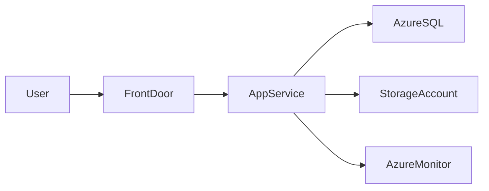

# 🌐 Basic Web App Architecture

> Reference architecture for deploying a scalable and secure web application in Azure.

---

## 📚 Table of Contents

- [🌐 Basic Web App Architecture](#-basic-web-app-architecture)
  - [📚 Table of Contents](#-table-of-contents)
- [📌 Overview](#-overview)
- [🏗️ Architecture Diagram](#️-architecture-diagram)
- [🔐 Core Components](#-core-components)
- [⚙️ Traffic Flow](#️-traffic-flow)
- [🧪 Real-World Scenario](#-real-world-scenario)
- [🚨 Common Issues](#-common-issues)
- [✅ Best Practices](#-best-practices)
- [📖 References](#-references)
- [🧠 Final Notes](#-final-notes)

---

# 📌 Overview

This architecture demonstrates a basic production-ready web application deployment using Azure services.

The design focuses on:

- Scalability
- Security
- Availability
- Monitoring
- Operational simplicity

---

# 🏗️ Architecture Diagram

---

# 🔐 Core Components

| Component | Purpose |
|---|---|
| Azure Front Door | Global traffic routing |
| App Service | Web application hosting |
| Azure SQL | Relational database |
| Storage Account | File and object storage |
| Azure Monitor | Monitoring and diagnostics |

---

# ⚙️ Traffic Flow

1. User accesses the application
2. Front Door routes traffic
3. App Service processes requests
4. Application communicates with Azure SQL
5. Logs and metrics sent to Azure Monitor

---

# 🧪 Real-World Scenario

| Scenario | Architecture Benefit |
|---|---|
| Enterprise portal | Scalable web hosting |
| Internal business app | Secure application delivery |
| Public-facing API | Global traffic optimization |

---

# 🚨 Common Issues

| Issue | Impact |
|---|---|
| Missing autoscaling | Performance degradation |
| Public database exposure | Security risk |
| Lack of monitoring | Reduced visibility |

---

# ✅ Best Practices

- Enable HTTPS only
- Use Managed Identities
- Restrict database access
- Enable diagnostics and alerts
- Use deployment slots
- Apply RBAC controls

---

# 📖 References

- [Microsoft Learn - Azure Web Application Architecture](https://learn.microsoft.com/en-us/azure/architecture/reference-architectures/app-service-web-app/basic-web-app)
- [Azure App Services Documentation](https://learn.microsoft.com/en-us/azure/app-service/)
- [Azure Architecture Center](https://learn.microsoft.com/en-us/azure/architecture/)

---

# 🧠 Final Notes

This architecture provides a strong foundation for hosting secure and scalable enterprise web applications in Azure.