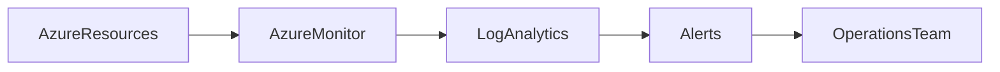

# 📊 Azure Monitoring Architecture

> Reference architecture for centralized monitoring, logging, and operational visibility in Azure.

---

## 📚 Table of Contents

- [� Azure Monitoring Architecture](#-azure-monitoring-architecture)
  - [📚 Table of Contents](#-table-of-contents)
- [📌 Overview](#-overview)
- [🏗️ Architecture Diagram](#️-architecture-diagram)
- [🔐 Core Components](#-core-components)
- [⚙️ Monitoring Flow](#️-monitoring-flow)
- [🧪 Real-World Scenario](#-real-world-scenario)
- [🚨 Common Issues](#-common-issues)
- [✅ Best Practices](#-best-practices)
- [📖 References](#-references)
- [🧠 Final Notes](#-final-notes)

---

# 📌 Overview

This monitoring architecture centralizes logs, metrics, alerts, and operational visibility across Azure resources.

The architecture supports:

- Infrastructure monitoring
- Centralized logging
- Alerting
- Operational dashboards
- Incident response workflows

---

# 🏗️ Architecture Diagram

---

# 🔐 Core Components

| Component | Purpose |
|---|---|
| Azure Monitor | Metrics and telemetry |
| Log Analytics | Centralized logging |
| Alerts | Incident notification |
| Dashboards | Operational visibility |

---

# ⚙️ Monitoring Flow

1. Azure resources generate telemetry
2. Logs and metrics sent to Azure Monitor
3. Log Analytics stores and analyzes data
4. Alerts notify operations teams

---

# 🧪 Real-World Scenario

| Scenario | Architecture Benefit |
|---|---|
| Security monitoring | Centralized visibility |
| VM performance tracking | Proactive operations |
| Incident response | Automated alerting |

---

# 🚨 Common Issues

| Issue | Impact |
|---|---|
| Missing diagnostics | Operational blind spots |
| Alert fatigue | Reduced incident response quality |
| Poor retention planning | Compliance gaps |

---

# ✅ Best Practices

- Centralize monitoring workspaces
- Use actionable alerts
- Monitor ingestion costs
- Define retention policies
- Enable diagnostics for critical resources
- Document operational baselines

---

# 📖 References

- [Microsoft Learn - Azure Monitor Architecture](https://learn.microsoft.com/en-us/azure/azure-monitor/)
- [Azure Log Analytics Documentation](https://learn.microsoft.com/en-us/azure/azure-monitor/logs/)
- [Azure Architecture Center](https://learn.microsoft.com/en-us/azure/architecture/)

---

# 🧠 Final Notes

Centralized monitoring architectures are essential for operational maturity, troubleshooting efficiency, and enterprise cloud reliability.