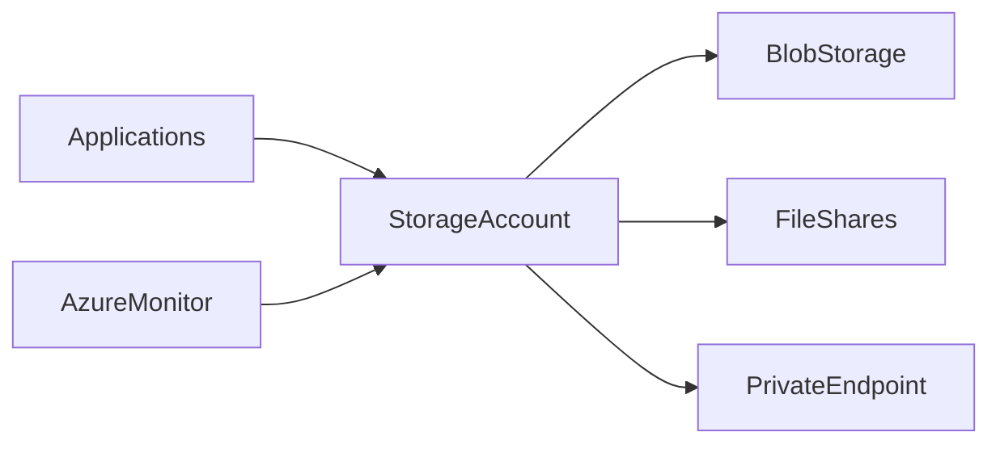

# 💾 Azure Storage Architecture

> Reference architecture for scalable and resilient Azure storage deployments.

---

## 📚 Table of Contents

- [� Azure Storage Architecture](#-azure-storage-architecture)
  - [📚 Table of Contents](#-table-of-contents)
- [📌 Overview](#-overview)
- [🏗️ Architecture Diagram](#️-architecture-diagram)
- [🔐 Core Components](#-core-components)
- [⚙️ Storage Flow](#️-storage-flow)
- [🧪 Real-World Scenario](#-real-world-scenario)
- [🚨 Common Issues](#-common-issues)
- [✅ Best Practices](#-best-practices)
- [📖 References](#-references)
- [🧠 Final Notes](#-final-notes)

---

# 📌 Overview

This architecture demonstrates enterprise Azure storage design patterns for durability, scalability, and operational security.

The design supports:

- Blob Storage
- File Shares
- Backup storage
- Monitoring integration
- Private connectivity

---

# 🏗️ Architecture Diagram

---

# 🔐 Core Components

| Component | Purpose |
|---|---|
| Storage Account | Central storage namespace |
| Blob Storage | Object storage |
| File Shares | SMB/NFS file storage |
| Private Endpoint | Secure private access |
| Azure Monitor | Storage diagnostics |

---

# ⚙️ Storage Flow

1. Applications connect to storage
2. Data stored in Blob or File Shares
3. Monitoring captures metrics and logs
4. Private endpoints secure communication

---

# 🧪 Real-World Scenario

| Scenario | Architecture Benefit |
|---|---|
| Enterprise backups | Durable storage |
| Hybrid file sharing | Azure Files integration |
| Application data storage | Scalable object storage |

---

# 🚨 Common Issues

| Issue | Impact |
|---|---|
| Public access exposure | Security risk |
| Incorrect redundancy selection | Availability limitations |
| Missing lifecycle policies | Increased storage costs |

---

# ✅ Best Practices

- Use private endpoints
- Enable soft delete
- Apply lifecycle management
- Monitor storage utilization
- Restrict public network access
- Use GRS or GZRS for critical data

---

# 📖 References

- [Microsoft Learn - Azure Storage Architecture](https://learn.microsoft.com/en-us/azure/storage/common/storage-account-overview)
- [Azure Storage Documentation](https://learn.microsoft.com/en-us/azure/storage/)
- [Azure Architecture Center](https://learn.microsoft.com/en-us/azure/architecture/)

---

# 🧠 Final Notes

Well-designed Azure storage architectures improve operational reliability, scalability, and data protection capabilities.