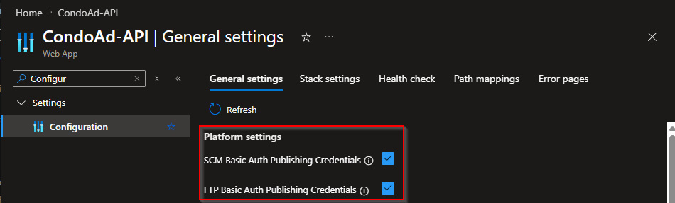
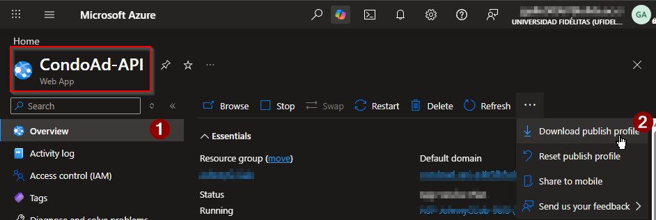
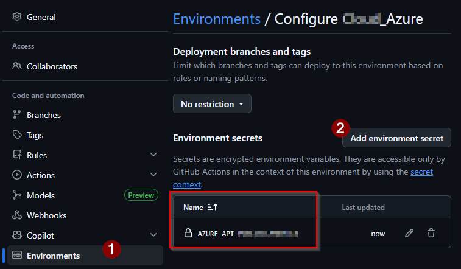

# 📘 Azure App Service Deployment Guide

> Step-by-step guide for configuring automated .NET API deployments to Azure App Service using GitHub Actions.

---

# 📚 Table of Contents

- [📌 Overview](#-overview)
- [⚙️ YAML Use Guide](#️-yaml-use-guide)
- [☁️ Download Publish Profile from Azure](#️-download-publish-profile-from-azure)
- [🔐 Create GitHub Secret](#-create-github-secret)
- [🚀 Run the Workflow](#-run-the-workflow)
- [🚨 Common Issues](#-common-issues)

---

# 📌 Overview

This guide explains how to:

- Configure a reusable GitHub Actions workflow
- Deploy a .NET API to Azure App Service
- Configure GitHub Secrets
- Download Azure Publish Profiles
- Identify project paths inside GitHub repositories

---

# ⚙️ YAML Use Guide

The deployment workflow uses a reusable YAML template.

All editable values are wrapped with:

```text
!-- YOUR_VALUE --!
```

These values must be replaced before using the workflow.

---

## 📂 Workflow Location

Create the workflow inside:

```text
.github/workflows/
```

Example:

```text
.github/workflows/deploy-api.yml
```

---

## 🧩 Main Editable Variables

| Variable | Description |
|---|---|
| `AZURE_WEBAPP_NAME` | Azure App Service name |
| `AZURE_WEBAPP_PACKAGE_PATH` | API project location |
| `YOUR_SOLUTION_PATH` | Solution `.sln` path |
| `API_PROJECT_PATH` | API `.csproj` path |
| `YOUR_SECRET_NAME` | GitHub Secret containing publish profile |

---

## 🔍 How to Find Project Paths

You can locate project paths directly from GitHub or Visual Studio.

Examples:

```text
MyProject.API/API/API.csproj
```

```text
MyProject.API/MyProject.API.sln
```

---

## 📸 Example Project Paths

!--! INSERT PROJECT STRUCTURE SCREENSHOT HERE !--!

---

## 📂 Example Architecture

```text
MyProject.API/
├── API/
├── Services/
├── Reglas/
├── DA/
└── MyProject.API.sln
```

---

## 🧠 Path Examples

### Solution Path

```yaml
dotnet restore "MyProject.API/MyProject.API.sln"
```

### API Project Path

```yaml
dotnet publish "MyProject.API/API/API.csproj"
```

---

# ☁️ Download Publish Profile from Azure

The Publish Profile allows GitHub Actions to deploy directly to Azure App Service.

---

## 📍 Azure Portal Navigation

Go to:

```text
Azure Portal
→ App Services
→ Your Web App
```

---

## 📥 Download Publish Profile

Inside the Azure App Service:

```text
Overview
→ Get publish profile
```

This downloads a `.PublishSettings` file.

---

## 📸 Download Publish Profile Button





---

> [!IMPORTANT]
> Never upload the publish profile file to GitHub.

---

# 🔐 Create GitHub Secret

The publish profile must be stored securely using GitHub Secrets.

---

## 📍 GitHub Navigation

Go to:

```text
GitHub Repository
→ Settings
→ Secrets and variables
→ Actions
```

---

## 📸 GitHub Secrets Page

!--! INSERT GITHUB SECRETS SCREENSHOT HERE !--!

---

## ➕ Create New Secret

Create a secret using:

| Field | Value |
|---|---|
| Name | `AZURE_API_PUBLISH_PROFILE` |
| Secret | Paste publish profile contents |

---

## 📸 Create Secret Example

!--! INSERT CREATE SECRET SCREENSHOT HERE !--!

---

# 🚀 Run the Workflow

After pushing changes to the configured branch:

```text
main
```

GitHub Actions automatically starts the deployment pipeline.

---

## 📍 GitHub Actions Navigation

```text
Repository
→ Actions
```

---

## 📸 GitHub Actions Pipeline

!--! INSERT GITHUB ACTIONS PIPELINE SCREENSHOT HERE !--!

---

## ✅ Successful Deployment

If the deployment succeeds:

- Build completes successfully
- Artifact uploads successfully
- Azure deployment completes successfully

---

## 📸 Successful Deployment Example



---

# 🚨 Common Issues

---

## ❌ Invalid Publish Profile

### Cause

Incorrect or expired publish profile.

### Solution

Re-download the publish profile from Azure.

---

## ❌ Project Path Not Found

### Cause

Incorrect `.csproj` or solution path.

### Solution

Verify paths directly from the repository structure.

---

## ❌ Deployment Succeeds but API Fails

### Cause

Missing environment variables.

### Solution

Configure required variables inside:

```text
Azure Portal
→ App Service
→ Environment Variables
```

---

# 🧠 Final Notes

This implementation demonstrates:

- Azure CI/CD automation
- GitHub Actions workflows
- Enterprise deployment pipelines
- Secure credential management
- Production-ready deployment practices