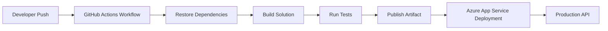

# 🚀 Azure App Service CI/CD with GitHub Actions

> Enterprise-style CI/CD workflow for deploying .NET APIs to Azure App Service using GitHub Actions.

---

# 📚 Table of Contents

- [� Azure App Service CI/CD with GitHub Actions](#-azure-app-service-cicd-with-github-actions)
- [📚 Table of Contents](#-table-of-contents)
- [📌 Overview](#-overview)
- [🏗️ Architecture](#️-architecture)
- [⚙️ Technologies Used](#️-technologies-used)
- [🚀 Features](#-features)
- [📂 Project Structure](#-project-structure)
- [📖 Documentation](#-documentation)
- [📸 Screenshots](#-screenshots)
- [📖 References](#-references)
- [🧠 Final Notes](#-final-notes)

---

# 📌 Overview

This project demonstrates how to automate deployments for a .NET API hosted on Azure App Service using GitHub Actions.

The workflow implements a production-style CI/CD pipeline that:

- Restores dependencies
- Builds the application
- Runs validations
- Publishes artifacts
- Deploys automatically to Azure App Service

This approach improves deployment consistency, reduces manual deployment errors, and enables faster release cycles.

---

# 🏗️ Architecture



---

# ⚙️ Technologies Used

| Technology | Purpose |
|---|---|
| GitHub Actions | CI/CD Automation |
| Azure App Service | API Hosting |
| .NET 8 | Backend Framework |
| GitHub Secrets | Secure Credential Storage |
| YAML | Pipeline Configuration |

---

# 🚀 Features

- Automated CI/CD deployments
- Azure App Service integration
- GitHub Actions pipeline
- Multi-project .NET support
- Artifact-based deployments
- Environment separation
- Production-ready workflow structure
- Reusable YAML deployment template

---

# 📂 Project Structure

```text
Deploy-API-Azure-AppService/
├── README.md
├── Guide.md
├── deploy-api.yml
└── screenshots/
```

| File | Description |
|---|---|
| `README.md` | Project overview and architecture |
| `Guide.md` | Step-by-step implementation guide |
| `deploy-api.yml` | Reusable GitHub Actions workflow |
| `screenshots/` | Azure and GitHub configuration screenshots |

---

# 📖 Documentation

| Document | Description |
|---|---|
| `Guide.md` | Full setup and configuration guide |
| `deploy-api.yml` | Reusable deployment workflow template |

---

# 📸 Screenshots

The guide includes screenshots for:

- Azure App Service configuration
- Publish Profile download
- GitHub Secrets setup
- GitHub Actions workflow execution
- Successful deployment validation

---

# 📖 References

- [GitHub Actions Documentation](https://docs.github.com/en/actions)
- [Azure App Service Documentation](https://learn.microsoft.com/en-us/azure/app-service/)
- [Azure Web Apps Deploy GitHub Action](https://github.com/Azure/webapps-deploy)
- [Deploy to Azure App Service using GitHub Actions](https://learn.microsoft.com/en-us/azure/app-service/deploy-github-actions)
- [.NET Documentation](https://learn.microsoft.com/en-us/dotnet/)

---

# 🧠 Final Notes

This project focuses on real-world deployment automation practices commonly used in enterprise cloud environments.

The implementation demonstrates:

- CI/CD automation
- Azure deployment workflows
- GitHub Actions architecture
- Environment-based deployments
- Secure secret management
- Enterprise workflow organization