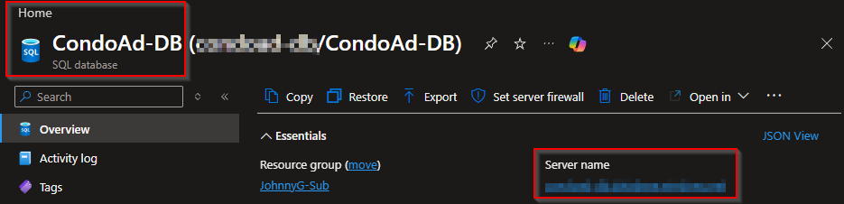
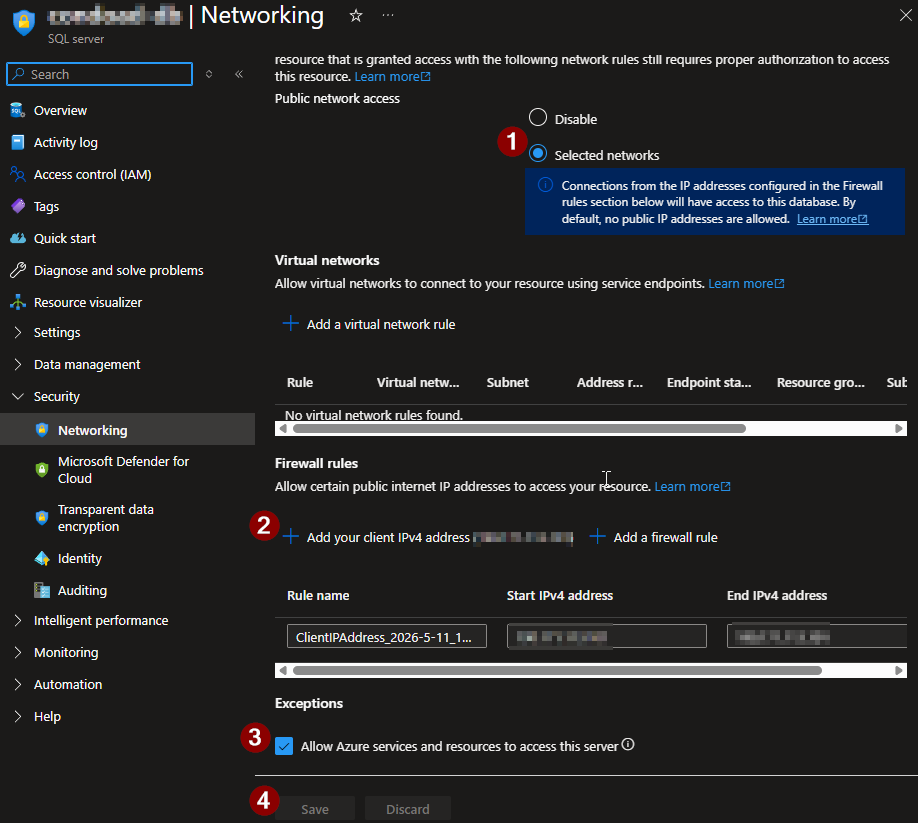
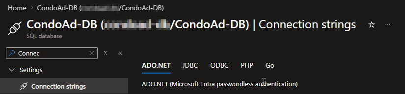
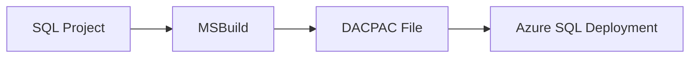
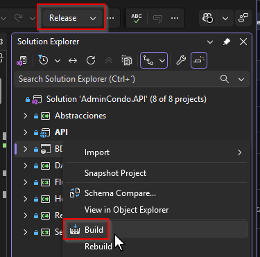
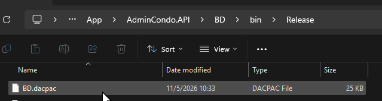

# 📘 Azure SQL Database Deployment Guide

> Step-by-step guide for deploying SQL Database Projects to Azure SQL Database using GitHub Actions and DACPAC deployments.

---

# 📚 Table of Contents

- [📌 Overview](#-overview)
- [⚙️ YAML Use Guide](#️-yaml-use-guide)
- [☁️ Azure SQL Setup](#️-azure-sql-setup)
- [🔐 Create GitHub Secret](#-create-github-secret)
- [🗄️ DACPAC Build Process](#️-dacpac-build-process)
- [🚀 Run the Workflow](#-run-the-workflow)
- [🚨 Common Issues](#-common-issues)

---

# 📌 Overview

This guide explains how to:

- Configure Azure SQL deployments
- Build SQL Database Projects
- Generate DACPAC packages
- Configure GitHub Secrets
- Deploy schema changes automatically using GitHub Actions

---

# ⚙️ YAML Use Guide

All editable values inside the workflow are wrapped with:

```text
!-- YOUR_VALUE --!
```

These values must be replaced before using the template.

---

## 📂 Workflow Location

Create the workflow inside:

```text
.github/workflows/
```

Example:

```text
.github/workflows/deploy-database.yml
```

---

## 🧩 Main Editable Variables

| Variable | Description |
|---|---|
| `AZURE_SQL_SERVER` | Azure SQL Server |
| `AZURE_SQL_DATABASE` | Azure SQL Database |
| `DACPAC_PATH` | Generated DACPAC file location |
| `YOUR_SECRET_NAME` | GitHub Secret containing SQL connection string |

---

## 🔍 SQL Project Paths

Important SQL project files:

| File Type | Purpose |
|---|---|
| `.sqlproj` | SQL Database Project |
| `.dacpac` | Deployment Package |
| `bin/Release/` | Build output folder |

---

# ☁️ Azure SQL Setup

Create:

- Azure SQL Server
- Azure SQL Database
- Firewall Rules

---

## 📍 Azure Portal Navigation

Go to:

```text
Azure Portal
→ SQL Databases
```

---

## 📸 Azure SQL Database Overview



---

## 🌐 Configure Firewall Rules

Inside Azure SQL Server:

```text
Networking
→ Firewall Rules
```

Enable access for:

- Your local IP
- Azure Services

---

## 📸 SQL Firewall Rules



---

## 🔗 Obtain Connection String

Inside Azure SQL Database:

```text
Settings
→ Connection Strings
```

---

## 📸 Connection String Screen



---

# 🔐 Create GitHub Secret

Store the SQL connection string securely using GitHub Secrets.

---

## 📍 GitHub Navigation

Go to:

```text
GitHub Repository
→ Settings
→ Secrets and variables
→ Actions
```

---

## ➕ Create Secret

| Field | Value |
|---|---|
| Name | `AZURE_SQL_CONNECTION_STRING` |
| Secret | Azure SQL Connection String |

---

## 📸 Create Secret Example


---

# 🗄️ DACPAC Build Process

The workflow builds a SQL Database Project and generates a DACPAC package.

---

# 🏗️ DACPAC Deployment Flow



---

## 📍 SQL Project Build

The workflow builds:

```text
BD.sqlproj
```

using:

```yaml
msbuild
```

---

## 📍 Generated DACPAC

The generated deployment package is:

```text
bin/Release/*.dacpac
```

---

## 📸 Generated DACPAC Example





---

# 🚀 Run the Workflow

After pushing SQL changes to:

```text
main
```

GitHub Actions automatically starts the database deployment pipeline.

---

## 📍 GitHub Actions Navigation

```text
Repository
→ Actions
```

---

## 📸 GitHub Actions Database Pipeline

!--! INSERT DATABASE PIPELINE SCREENSHOT HERE !--!

---

## ✅ Successful Deployment

A successful deployment:

- Builds the SQL project
- Generates the DACPAC
- Publishes schema changes to Azure SQL Database

---

## 📸 Successful Deployment Example

!--! INSERT SUCCESSFUL DATABASE DEPLOYMENT SCREENSHOT HERE !--!

---

# 🚨 Common Issues

---

## ❌ DACPAC File Not Found

### Cause

Incorrect DACPAC path.

### Solution

Verify:

```text
bin/Release/
```

contains the generated `.dacpac` file.

---

## ❌ SQL Authentication Failed

### Cause

Incorrect connection string.

### Solution

Verify the GitHub Secret configuration.

---

## ❌ Firewall Blocked Connection

### Cause

Azure SQL Firewall Rules not configured.

### Solution

Allow Azure services and your local IP.

---

## ❌ Data Loss Prevention Blocked Deployment

### Cause

Potential destructive schema changes detected.

### Solution

Review:

```yaml
/p:BlockOnPossibleDataLoss=true
```

---

# 🧠 Final Notes

This implementation demonstrates:

- Database CI/CD workflows
- DACPAC deployments
- Azure SQL automation
- SQL schema versioning
- Enterprise DevOps practices