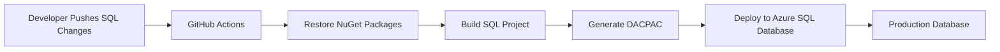

# 🗄️ Azure SQL Database CI/CD with GitHub Actions

> Enterprise-style database deployment workflow using DACPAC and GitHub Actions for Azure SQL Database.

---

# 📚 Table of Contents

- [�️ Azure SQL Database CI/CD with GitHub Actions](#️-azure-sql-database-cicd-with-github-actions)
- [📚 Table of Contents](#-table-of-contents)
- [📌 Overview](#-overview)
- [🏗️ Architecture](#️-architecture)
- [⚙️ Technologies Used](#️-technologies-used)
- [🚀 Features](#-features)
- [📂 Project Structure](#-project-structure)
- [📖 Documentation](#-documentation)
- [📸 Screenshots](#-screenshots)
- [📖 References](#-references)
- [🧠 Final Notes](#-final-notes)

---

# 📌 Overview

This project demonstrates how to automate Azure SQL Database deployments using:

- GitHub Actions
- SQL Database Projects
- DACPAC deployments
- Azure SQL Database

The workflow automatically:

- Restores NuGet dependencies
- Builds the SQL project
- Generates a DACPAC package
- Deploys schema changes to Azure SQL Database

This approach improves deployment consistency, reduces manual deployment risks, and enables production-style database CI/CD workflows.

---

# 🏗️ Architecture



---

# ⚙️ Technologies Used

| Technology | Purpose |
|---|---|
| GitHub Actions | CI/CD Automation |
| Azure SQL Database | Database Hosting |
| SQL Database Projects | Database Schema Management |
| DACPAC | Database Deployment Package |
| MSBuild | SQL Project Compilation |
| GitHub Secrets | Secure Credential Storage |
| YAML | Pipeline Configuration |

---

# 🚀 Features

- Automated Azure SQL deployments
- DACPAC-based deployment workflow
- GitHub Actions integration
- SQL schema versioning
- Environment-based deployments
- Secure secret management
- Production-ready database deployment pipeline

---

# 📂 Project Structure

```text
Deploy-SQL-Azure/
├── README.md
├── Guide.md
├── deploy-database.yml
└── screenshots/
```

| File | Description |
|---|---|
| `README.md` | Project overview and architecture |
| `Guide.md` | Step-by-step setup and deployment guide |
| `deploy-database.yml` | Reusable GitHub Actions workflow |
| `screenshots/` | Azure and GitHub configuration screenshots |

---

# 📖 Documentation

| Document | Description |
|---|---|
| `Guide.md` | Full Azure SQL deployment guide |
| `deploy-database.yml` | Reusable DACPAC deployment template |

---

# 📸 Screenshots

The guide includes screenshots for:

- Azure SQL Database setup
- SQL Firewall configuration
- Connection String configuration
- GitHub Secrets setup
- GitHub Actions pipeline execution
- Successful DACPAC deployment

---

# 📖 References

- [GitHub Actions Documentation](https://docs.github.com/en/actions)
- [Azure SQL Documentation](https://learn.microsoft.com/en-us/azure/azure-sql/)
- [Azure SQL GitHub Action](https://github.com/Azure/sql-action)
- [SQL Database Projects Documentation](https://learn.microsoft.com/en-us/sql/tools/sql-database-projects/)
- [DACPAC Documentation](https://learn.microsoft.com/en-us/sql/tools/sqlpackage/sqlpackage)

---

# 🧠 Final Notes

This project demonstrates enterprise database deployment practices commonly used in production environments.

The implementation focuses on:

- Database CI/CD
- DACPAC deployments
- Azure SQL automation
- SQL schema management
- Secure deployment practices
- Enterprise DevOps workflows