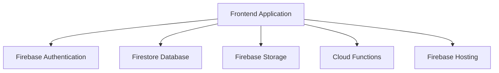
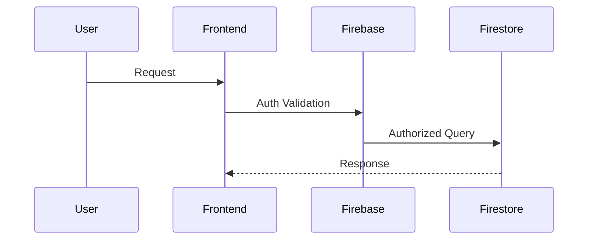

# Firebase Architecture

> Understanding Firebase cloud architecture, managed services, and serverless infrastructure design.

---

# 📚 Table of Contents

- [📌 Overview](#-overview)
- [🏗️ Firebase Architecture Model](#️-firebase-architecture-model)
- [⚙️ Core Components](#️-core-components)
- [🔐 Security Architecture](#-security-architecture)
- [📊 Request Flow](#-request-flow)
- [✅ Best Practices](#-best-practices)
- [📖 References](#-references)

---

# 📌 Overview

Firebase uses a serverless architecture built on top of Google Cloud infrastructure.

Applications interact directly with managed cloud services instead of traditional backend servers.

---

# 🏗️ Firebase Architecture Model

---

# ⚙️ Core Components

## Authentication

Provides user identity management.

## Firestore

NoSQL cloud database for real-time applications.

## Storage

Stores files, images, and documents.

## Cloud Functions

Runs backend logic serverlessly.

## Hosting

Global hosting infrastructure with CDN support.

---

# 🔐 Security Architecture

> [!IMPORTANT]
> Firebase security heavily relies on Security Rules.

Security layers include:

- Authentication
- Firestore Security Rules
- Storage Security Rules
- IAM integration

---

# 📊 Request Flow

---

# ✅ Best Practices

- Use least-privilege access
- Separate environments
- Avoid exposing sensitive data
- Implement monitoring
- Optimize Firestore queries

---

# 📖 References

- https://firebase.google.com/docs
- https://firebase.google.com/docs/firestore
- https://firebase.google.com/docs/functions
- https://cloud.google.com/architecture

---

# 🧠 Final Notes

Firebase architecture enables scalable serverless systems with minimal operational overhead.