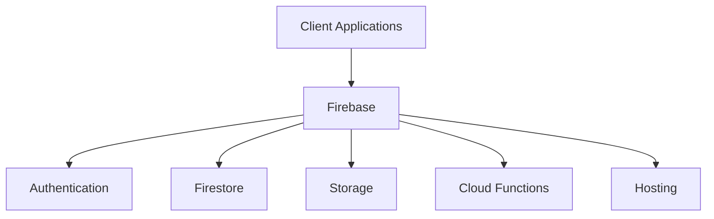

# Firebase Overview

> Introduction to Firebase as a Backend-as-a-Service platform for scalable web and mobile applications.

---

# 📚 Table of Contents

- [Firebase Overview](#firebase-overview)
- [📚 Table of Contents](#-table-of-contents)
- [📌 Overview](#-overview)
- [🏗️ Firebase Ecosystem](#️-firebase-ecosystem)
- [⚙️ Core Services](#️-core-services)
- [✅ Advantages](#-advantages)
  - [Main Benefits](#main-benefits)
- [⚠️ Limitations](#️-limitations)
  - [Common Limitations](#common-limitations)
- [📊 Common Use Cases](#-common-use-cases)
- [📖 References](#-references)
- [🧠 Final Notes](#-final-notes)

---

# 📌 Overview

Firebase is a Backend-as-a-Service (BaaS) platform developed by Google that provides managed cloud infrastructure and backend services.

Firebase helps developers build applications faster by reducing infrastructure management complexity.

---

# 🏗️ Firebase Ecosystem

Firebase integrates multiple cloud services into a unified platform.

---

# ⚙️ Core Services

| Service | Purpose |
|---|---|
| Authentication | User identity management |
| Firestore | NoSQL cloud database |
| Storage | File storage system |
| Cloud Functions | Serverless backend execution |
| Hosting | Global web hosting |
| Analytics | User analytics |
| Crashlytics | Error monitoring |

---

# ✅ Advantages

> [!TIP]
> Firebase significantly accelerates MVP and startup development.

## Main Benefits

- Rapid development
- Automatic scaling
- Global infrastructure
- Real-time synchronization
- Integrated security
- Serverless architecture
- Simplified deployments

---

# ⚠️ Limitations

> [!WARNING]
> Firebase may not fit all enterprise workloads.

## Common Limitations

- Vendor lock-in
- Complex pricing at scale
- NoSQL query limitations
- Reduced relational modeling support

---

# 📊 Common Use Cases

- SaaS applications
- Chat applications
- Authentication systems
- Mobile applications
- Portfolio projects
- Serverless APIs

---

# 📖 References

- https://firebase.google.com/docs
- https://firebase.google.com/products
- https://cloud.google.com/

---

# 🧠 Final Notes

Firebase is optimized for modern serverless applications requiring rapid iteration and scalable infrastructure.