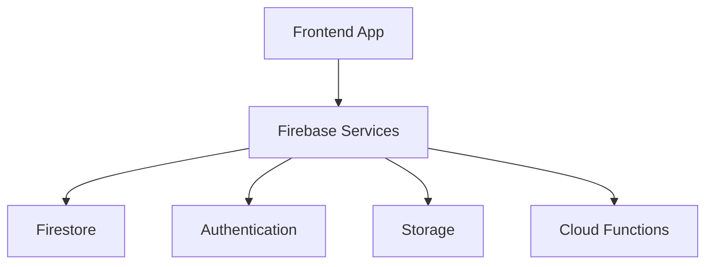

# Firebase vs Traditional Backend

> Comparing Firebase serverless architecture with traditional backend infrastructure models.

---

# 📚 Table of Contents

- [📌 Overview](#-overview)
- [🏗️ Traditional Backend](#️-traditional-backend)
- [☁️ Firebase Backend Model](#️-firebase-backend-model)
- [📊 Comparison Table](#-comparison-table)
- [✅ Advantages of Firebase](#-advantages-of-firebase)
- [⚠️ When Traditional Backends Are Better](#️-when-traditional-backends-are-better)
- [📖 References](#-references)

---

# 📌 Overview

Modern applications can be built using traditional backend infrastructure or serverless platforms like Firebase.

Understanding the differences helps engineers choose the correct architecture for production systems.

---

# 🏗️ Traditional Backend

Traditional backend architectures usually include:

- Virtual machines
- Backend APIs
- Load balancers
- SQL databases
- Authentication servers
- Infrastructure management

---

# ☁️ Firebase Backend Model

Firebase abstracts infrastructure management using managed cloud services.

---

# 📊 Comparison Table

| Feature | Firebase | Traditional Backend |
|---|---|---|
| Infrastructure Management | Managed | Self-managed |
| Scaling | Automatic | Manual |
| Server Maintenance | None | Required |
| Real-Time Features | Native | Custom Implementation |
| Deployment Complexity | Low | Medium/High |
| Development Speed | Fast | Slower |
| Database Type | NoSQL | Usually SQL |

---

# ✅ Advantages of Firebase

> [!TIP]
> Firebase is excellent for rapid development and serverless applications.

- Faster deployments
- Reduced DevOps complexity
- Real-time synchronization
- Global CDN support
- Simplified authentication

---

# ⚠️ When Traditional Backends Are Better

> [!WARNING]
> Some enterprise systems may require traditional backend architectures.

Traditional backends are preferable when:

- Complex relational databases are required
- Full infrastructure control is necessary
- Multi-cloud strategies are needed
- Legacy systems exist

---

# 📖 References

- https://firebase.google.com/docs
- https://cloud.google.com/
- https://firebase.google.com/docs/firestore

---

# 🧠 Final Notes

Firebase simplifies backend engineering significantly but should be selected according to workload requirements and scalability expectations.