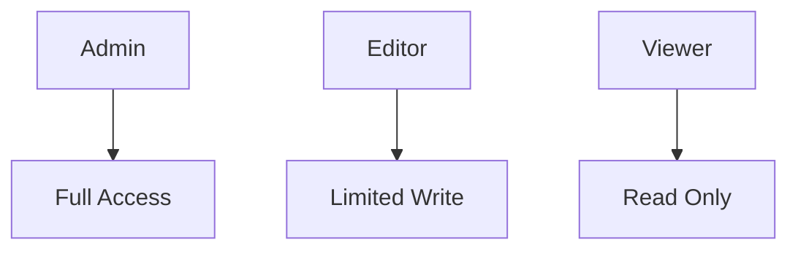

# Custom Claims

> Implementing role-based access control using Firebase custom claims.

---

# 📚 Table of Contents

- [📌 Overview](#-overview)
- [🏗️ RBAC Model](#️-rbac-model)
- [⚙️ Custom Claims Example](#️-custom-claims-example)
- [🔐 Security Considerations](#-security-considerations)
- [📖 References](#-references)

---

# 📌 Overview

Custom claims allow role-based authorization inside Firebase Authentication tokens.

---

# 🏗️ RBAC Model



---

# ⚙️ Custom Claims Example

```javascript
admin.auth().setCustomUserClaims(uid, {
  admin: true
});
```

---

# 🔐 Security Considerations

> [!IMPORTANT]
> Claims should always be validated server-side.

Best practices:

- Use least privilege
- Avoid excessive permissions
- Rotate elevated accounts

---

# 📖 References

- https://firebase.google.com/docs/auth/admin/custom-claims
- https://firebase.google.com/docs/auth

---

# 🧠 Final Notes

Custom claims are critical for implementing enterprise authorization models.