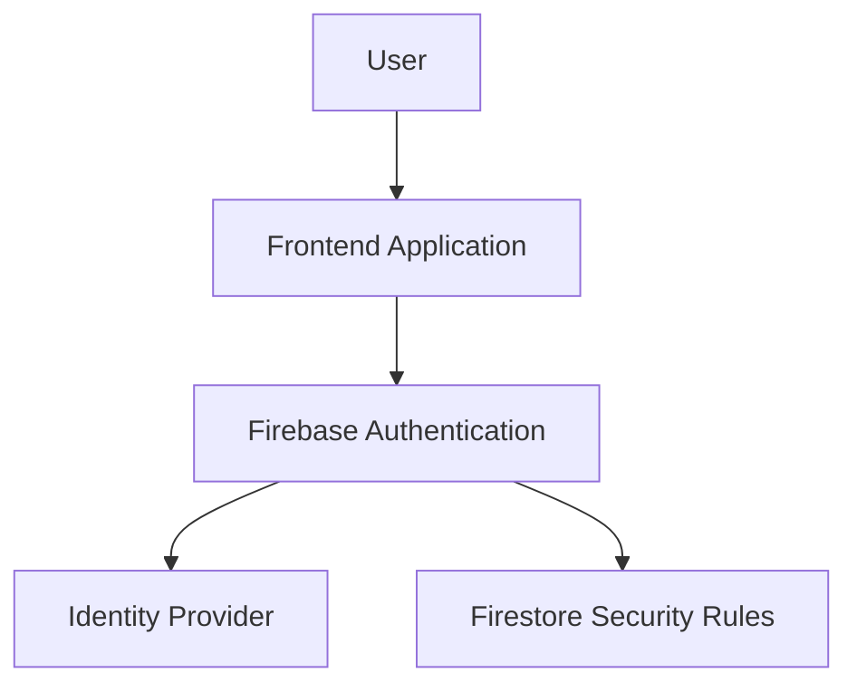

# Firebase Authentication

> Understanding Firebase Authentication architecture, providers, and identity management workflows.

---

# 📚 Table of Contents

- [📌 Overview](#-overview)
- [🏗️ Authentication Architecture](#️-authentication-architecture)
- [⚙️ Authentication Providers](#️-authentication-providers)
- [🔐 Security Model](#-security-model)
- [🚨 Common Issues](#-common-issues)
- [✅ Best Practices](#-best-practices)
- [📖 References](#-references)

---

# 📌 Overview

Firebase Authentication provides backend identity services for web and mobile applications.

It supports:

- Email/password login
- OAuth providers
- Anonymous authentication
- MFA
- Custom authentication systems

---

# 🏗️ Authentication Architecture

---

# ⚙️ Authentication Providers

| Provider | Description |
|---|---|
| Email/Password | Traditional credentials |
| Google | OAuth Google login |
| GitHub | GitHub OAuth integration |
| Anonymous | Guest sessions |
| Custom Auth | External identity providers |

---

# 🔐 Security Model

> [!IMPORTANT]
> Firebase Authentication integrates directly with Firebase Security Rules.

Authentication tokens include:

- User ID
- Provider information
- Custom claims
- Session metadata

---

# 🚨 Common Issues

| Issue | Cause |
|---|---|
| Invalid token | Expired session |
| OAuth failure | Provider misconfiguration |
| Permission denied | Missing rules |

---

# ✅ Best Practices

- Enable MFA
- Use HTTPS only
- Implement token validation
- Use least-privilege access
- Rotate credentials regularly

---

# 📖 References

- https://firebase.google.com/docs/auth
- https://firebase.google.com/docs/auth/web/start

---

# 🧠 Final Notes

Authentication should always be treated as a core security component in cloud-native systems.