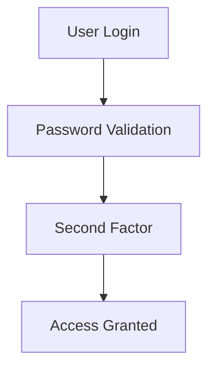

# Multi Factor Authentication

> Strengthening Firebase Authentication security using MFA mechanisms.

---

# 📚 Table of Contents

- [📌 Overview](#-overview)
- [🔐 MFA Architecture](#-mfa-architecture)
- [⚙️ Configuration](#️-configuration)
- [✅ Best Practices](#-best-practices)
- [📖 References](#-references)

---

# 📌 Overview

MFA adds additional verification layers beyond passwords.

---

# 🔐 MFA Architecture

---

# ⚙️ Configuration

Enable MFA in Firebase Authentication settings.

---

# ✅ Best Practices

- Require MFA for admins
- Use trusted devices
- Monitor login attempts
- Enforce session expiration

---

# 📖 References

- https://firebase.google.com/docs/auth/web/multi-factor
- https://cloud.google.com/identity-platform/docs/mfa

---

# 🧠 Final Notes

MFA is essential for enterprise-grade authentication security.