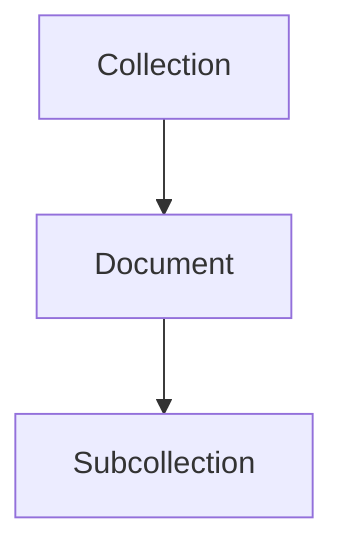

# Collections and Documents

> Understanding Firestore document structure and NoSQL data organization.

---

# 📚 Table of Contents

- [Collections and Documents](#collections-and-documents)
- [📚 Table of Contents](#-table-of-contents)
- [📌 Overview](#-overview)
- [🏗️ Firestore Structure](#️-firestore-structure)
- [📂 Collections](#-collections)
- [📄 Documents](#-documents)
- [🧪 Example Structure](#-example-structure)
- [✅ Best Practices](#-best-practices)
- [📖 References](#-references)
- [🧠 Final Notes](#-final-notes)

---

# 📌 Overview

Firestore organizes data using collections and documents.

---

# 🏗️ Firestore Structure



---

# 📂 Collections

Collections group related documents.

Example:

```bash
users/
products/
orders/
```

---

# 📄 Documents

Documents contain fields and values.

Example:

```json
{
  "name": "John",
  "role": "admin"
}
```

---

# 🧪 Example Structure

```bash
users/
    user123/
        profile/
        settings/
```

---

# ✅ Best Practices

- Avoid deeply nested collections
- Keep documents small
- Use predictable naming
- Design for query efficiency

---

# 📖 References

- https://firebase.google.com/docs/firestore/data-model
- https://cloud.google.com/firestore/docs

---

# 🧠 Final Notes

Proper Firestore modeling is critical for scalability and query efficiency.