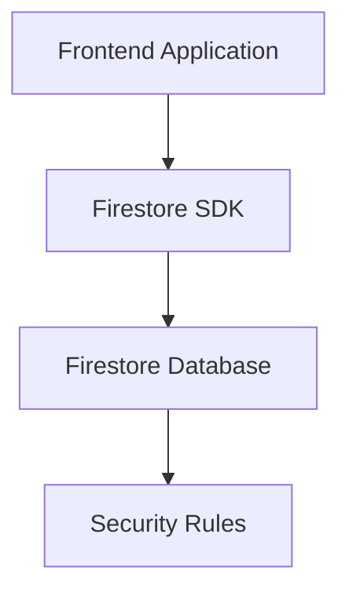

# Firestore Overview

> Understanding Cloud Firestore architecture, NoSQL concepts, and scalable cloud database systems.

---

# 📚 Table of Contents

- [Firestore Overview](#firestore-overview)
- [📚 Table of Contents](#-table-of-contents)
- [📌 Overview](#-overview)
- [🏗️ Firestore Architecture](#️-firestore-architecture)
- [⚙️ Core Features](#️-core-features)
- [📊 Firestore Model](#-firestore-model)
- [✅ Advantages](#-advantages)
- [⚠️ Limitations](#️-limitations)
- [📖 References](#-references)
- [🧠 Final Notes](#-final-notes)

---

# 📌 Overview

Cloud Firestore is a serverless NoSQL document database developed by Google.

Firestore provides:

- Real-time synchronization
- Horizontal scalability
- Automatic replication
- Offline support
- Strong security integration

---

# 🏗️ Firestore Architecture

---

# ⚙️ Core Features

| Feature | Description |
|---|---|
| Real-Time Sync | Live updates |
| NoSQL Database | Document-oriented storage |
| Offline Support | Local caching |
| Automatic Scaling | Managed infrastructure |
| Security Rules | Access control |

---

# 📊 Firestore Model

Firestore stores data using:

- Collections
- Documents
- Fields
- Subcollections

---

# ✅ Advantages

> [!TIP]
> Firestore simplifies real-time application development significantly.

- Real-time updates
- Automatic scaling
- Global infrastructure
- Strong SDK support
- Integrated authentication

---

# ⚠️ Limitations

> [!WARNING]
> Poor query design may generate excessive costs.

Limitations include:

- No relational joins
- Query restrictions
- Billing based on reads/writes

---

# 📖 References

- https://firebase.google.com/docs/firestore
- https://cloud.google.com/firestore

---

# 🧠 Final Notes

Firestore is optimized for scalable, event-driven, cloud-native systems.