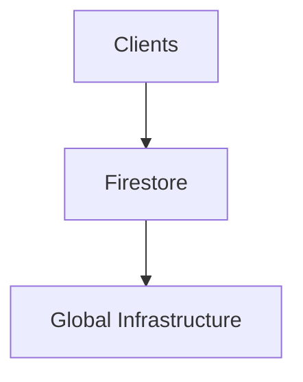

# Firestore Scaling

> Scaling Firestore databases for enterprise-grade workloads.

---

# 📚 Table of Contents

- [Firestore Scaling](#firestore-scaling)
- [📚 Table of Contents](#-table-of-contents)
- [📌 Overview](#-overview)
- [🏗️ Scaling Model](#️-scaling-model)
- [⚙️ Scaling Challenges](#️-scaling-challenges)
- [✅ Best Practices](#-best-practices)
- [📖 References](#-references)
- [🧠 Final Notes](#-final-notes)

---

# 📌 Overview

Firestore automatically scales infrastructure based on workload demands.

---

# 🏗️ Scaling Model

---

# ⚙️ Scaling Challenges

Common scaling concerns:

- Hotspotting
- Excessive reads
- Large listeners
- Poor indexing

---

# ✅ Best Practices

- Use distributed document IDs
- Paginate queries
- Optimize indexes
- Reduce unnecessary reads

---

# 📖 References

- https://firebase.google.com/docs/firestore/best-practices
- https://cloud.google.com/firestore/docs/best-practices

---

# 🧠 Final Notes

Firestore scales extremely well when databases are modeled correctly.