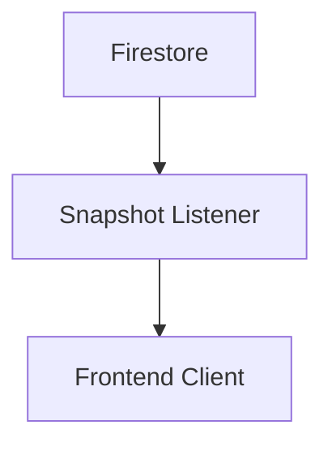

# Real Time Listeners

> Implementing real-time synchronization using Firestore listeners.

---

# 📚 Table of Contents

- [Real Time Listeners](#real-time-listeners)
- [📚 Table of Contents](#-table-of-contents)
- [📌 Overview](#-overview)
- [⚙️ Listener Architecture](#️-listener-architecture)
- [🧪 Listener Example](#-listener-example)
- [⚠️ Performance Considerations](#️-performance-considerations)
- [📖 References](#-references)
- [🧠 Final Notes](#-final-notes)

---

# 📌 Overview

Firestore supports real-time updates using listeners.

---

# ⚙️ Listener Architecture



---

# 🧪 Listener Example

```javascript
db.collection("users")
  .onSnapshot((snapshot) => {
    console.log(snapshot.docs);
  });
```

---

# ⚠️ Performance Considerations

> [!WARNING]
> Excessive listeners may increase billing costs.

Recommendations:

- Unsubscribe unused listeners
- Limit query scope
- Paginate large datasets

---

# 📖 References

- https://firebase.google.com/docs/firestore/query-data/listen
- https://cloud.google.com/firestore/docs

---

# 🧠 Final Notes

Real-time synchronization is one of Firestore's most powerful features.