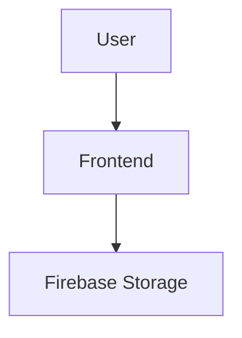

# File Uploads

> Implementing secure and scalable file upload systems using Firebase Storage.

---

# 📚 Table of Contents

- [File Uploads](#file-uploads)
- [📚 Table of Contents](#-table-of-contents)
- [📌 Overview](#-overview)
- [⚙️ Upload Workflow](#️-upload-workflow)
- [🧪 Upload Example](#-upload-example)
- [🔐 Security Considerations](#-security-considerations)
- [🚨 Common Issues](#-common-issues)
- [📖 References](#-references)
- [🧠 Final Notes](#-final-notes)

---

# 📌 Overview

Firebase Storage supports direct client-side uploads to cloud storage buckets.

---

# ⚙️ Upload Workflow



---

# 🧪 Upload Example

```javascript
import { ref, uploadBytes } from "firebase/storage";

const storageRef = ref(storage, "images/photo.png");

uploadBytes(storageRef, file);
```

---

# 🔐 Security Considerations

> [!WARNING]
> Unrestricted uploads may expose systems to abuse and malicious files.

Best practices:

- Validate file types
- Limit upload size
- Restrict public access
- Scan uploaded content

---

# 🚨 Common Issues

| Issue | Cause |
|---|---|
| Upload failed | Invalid permissions |
| File too large | Upload limits |
| Unauthorized access | Missing authentication |

---

# 📖 References

- https://firebase.google.com/docs/storage/web/upload-files
- https://cloud.google.com/storage/docs

---

# 🧠 Final Notes

Secure upload validation is essential for production storage systems.