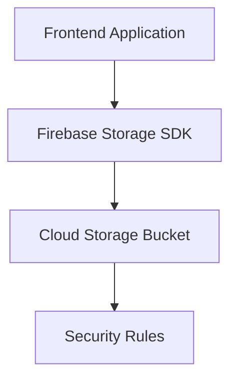

# Firebase Storage

> Understanding Firebase cloud object storage architecture and scalable media management systems.

---

# 📚 Table of Contents

- [Firebase Storage](#firebase-storage)
- [📚 Table of Contents](#-table-of-contents)
- [📌 Overview](#-overview)
- [🏗️ Storage Architecture](#️-storage-architecture)
- [⚙️ Core Features](#️-core-features)
- [🔐 Security Model](#-security-model)
- [✅ Advantages](#-advantages)
- [📖 References](#-references)
- [🧠 Final Notes](#-final-notes)

---

# 📌 Overview

Firebase Storage provides scalable object storage built on Google Cloud Storage infrastructure.

It is commonly used for:

- Image uploads
- PDF storage
- Media hosting
- User-generated content
- Backup systems

---

# 🏗️ Storage Architecture

---

# ⚙️ Core Features

| Feature | Description |
|---|---|
| File Uploads | Upload large files |
| Object Storage | Store binary content |
| Global Infrastructure | Google Cloud network |
| Access Control | Security Rules |
| Metadata Support | File metadata management |

---

# 🔐 Security Model

> [!IMPORTANT]
> Firebase Storage access should always be protected using Storage Security Rules.

Security layers include:

- Authentication
- Storage Rules
- Bucket permissions
- Signed URLs

---

# ✅ Advantages

- Global scalability
- Integrated authentication
- High durability
- Secure uploads
- CDN integration

---

# 📖 References

- https://firebase.google.com/docs/storage
- https://cloud.google.com/storage

---

# 🧠 Final Notes

Firebase Storage simplifies secure cloud file management for modern applications.