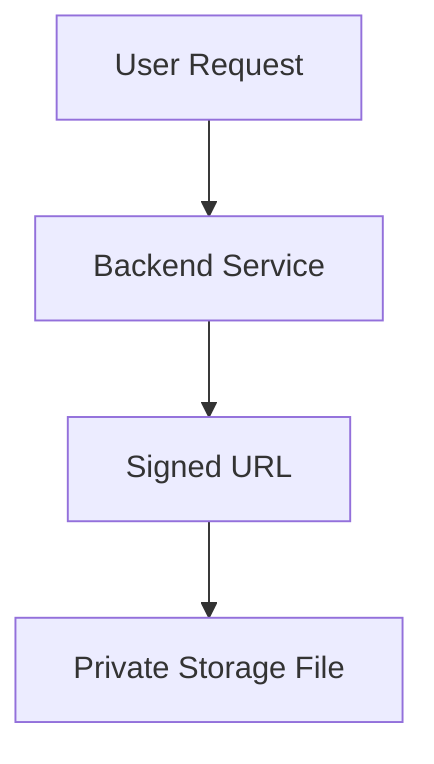

# Signed URLs

> Generating temporary secure access links for Firebase Storage objects.

---

# 📚 Table of Contents

- [Signed URLs](#signed-urls)
- [📚 Table of Contents](#-table-of-contents)
- [📌 Overview](#-overview)
- [⚙️ Signed URL Workflow](#️-signed-url-workflow)
- [🔐 Security Benefits](#-security-benefits)
- [⚠️ Risks](#️-risks)
- [📖 References](#-references)
- [🧠 Final Notes](#-final-notes)

---

# 📌 Overview

Signed URLs provide temporary secure access to private storage objects.

---

# ⚙️ Signed URL Workflow

---

# 🔐 Security Benefits

Advantages:

- Temporary access
- Controlled expiration
- Reduced public exposure
- Secure sharing

---

# ⚠️ Risks

> [!WARNING]
> Long expiration windows increase exposure risk.

Recommendations:

- Use short expiration times
- Restrict sensitive files
- Rotate access strategies

---

# 📖 References

- https://cloud.google.com/storage/docs/access-control/signed-urls
- https://firebase.google.com/docs/storage

---

# 🧠 Final Notes

Signed URLs are essential for secure temporary file distribution workflows.