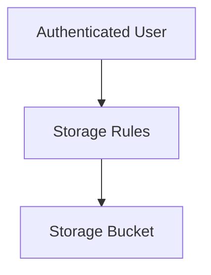

# Storage Security Rules

> Protecting Firebase Storage resources using granular access control rules.

---

# 📚 Table of Contents

- [Storage Security Rules](#storage-security-rules)
- [📚 Table of Contents](#-table-of-contents)
- [📌 Overview](#-overview)
- [🔐 Security Architecture](#-security-architecture)
- [🧪 Rules Example](#-rules-example)
- [⚠️ Common Risks](#️-common-risks)
- [✅ Best Practices](#-best-practices)
- [📖 References](#-references)
- [🧠 Final Notes](#-final-notes)

---

# 📌 Overview

Storage Security Rules define who can access files inside Firebase Storage buckets.

---

# 🔐 Security Architecture



---

# 🧪 Rules Example

```javascript
rules_version = '2';

service firebase.storage {
  match /b/{bucket}/o {
    match /users/{userId}/{allPaths=**} {
      allow read, write: if request.auth != null;
    }
  }
}
```

---

# ⚠️ Common Risks

> [!WARNING]
> Public buckets may expose sensitive data.

Security risks include:

- Public file exposure
- Malicious uploads
- Unauthorized downloads

---

# ✅ Best Practices

- Restrict anonymous access
- Validate authentication
- Separate sensitive buckets
- Apply least privilege

---

# 📖 References

- https://firebase.google.com/docs/storage/security
- https://cloud.google.com/storage/docs/access-control

---

# 🧠 Final Notes

Storage Security Rules are critical for protecting cloud object storage systems.