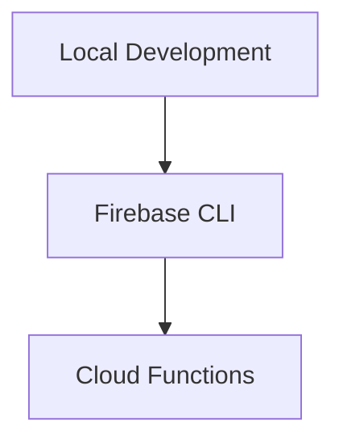

# Functions Deployment

> Deploying Firebase Cloud Functions to production environments.

---

# 📚 Table of Contents

- [Functions Deployment](#functions-deployment)
- [📚 Table of Contents](#-table-of-contents)
- [📌 Overview](#-overview)
- [⚙️ Deployment Workflow](#️-deployment-workflow)
- [🧪 Deployment Commands](#-deployment-commands)
- [🚨 Common Issues](#-common-issues)
- [📖 References](#-references)
- [🧠 Final Notes](#-final-notes)

---

# 📌 Overview

Cloud Functions deployments publish backend logic to Google Cloud infrastructure.

---

# ⚙️ Deployment Workflow



---

# 🧪 Deployment Commands

Deploy all functions:

```bash
firebase deploy --only functions
```

Deploy a single function:

```bash
firebase deploy --only functions:functionName
```

---

# 🚨 Common Issues

| Issue | Cause |
|---|---|
| Deployment failed | Syntax errors |
| Permission denied | Missing IAM permissions |
| Timeout | Long initialization |

---

# 📖 References

- https://firebase.google.com/docs/functions/manage-functions
- https://firebase.google.com/docs/cli

---

# 🧠 Final Notes

Reliable deployment workflows are critical for production serverless systems.